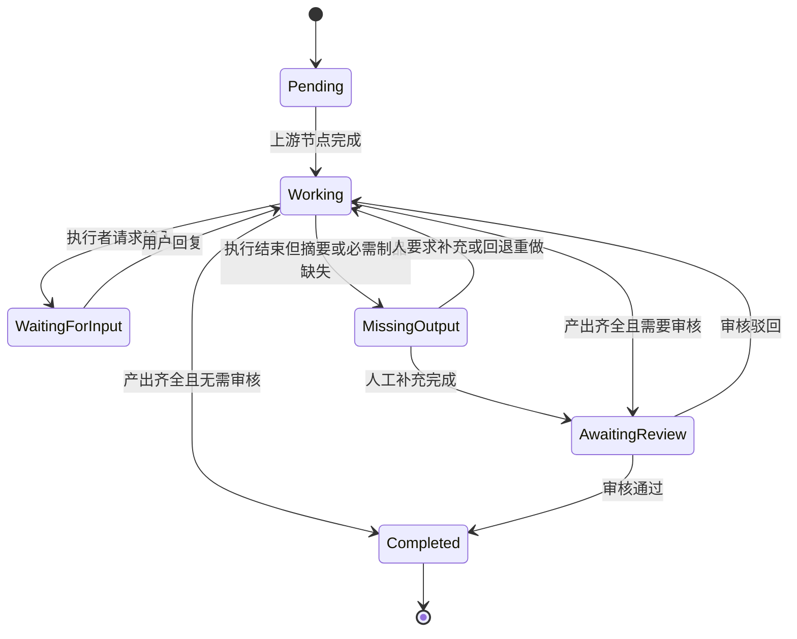

# 工作流节点交接与制品方案

## 1. 结论

工作流节点不提供用户自定义的结构化业务字段。已经实现的这套能力按本方案移除，移除前先补齐它承担的流转职责。

节点之间通过以下信息协作：

1. **父需求**：工作流绑定的父 issue，保存原始目标与约束。子 issue 中保留引用，不保留副本。
2. **交接摘要**：当前节点执行者在完成节点时提交的短结论，自动注入直接下游节点。
3. **制品（Artifact）**：节点正式产出的 Markdown 文档、文件或代码评审链接，在同一次工作流运行内共享。
4. **评论**：保留讨论过程，默认不注入下游上下文，需要时按需查询。
5. **系统控制信号**：节点状态、审批结果、阻塞状态和分支选择，由系统定义，不允许用户扩展任意字段。

核心原则是：

> 自动注入短摘要和内容索引，完整内容按需读取；业务结论写入制品，流程状态由系统控制。

落地形态上，这套方案不新增数据表：

- 交接摘要复用 `workflow_node_submission.summary`。
- 制品索引复用 `workflow_node_submission.evidence`（当前为空占位）。
- 节点导航信息复用 `issue.metadata`（已有 JSONB 列和 GIN 索引）。
- 制品使用独立实体，正文按类型分流到数据库列或现有附件（见 §9.1、§9.5）。
- 新增 `multica workflow` CLI 命令组，作为智能体的唯一导航入口。

## 2. 背景

工作流从父 issue 创建多个节点子 issue。父 issue 中保存了用户最初描述的需求。

### 2.1 现状

已提交代码中，节点子 issue 的描述**只来自任务模板**：

```go
Description: pgtype.Text{
    String: template.Description, Valid: strings.TrimSpace(template.Description) != "",
},
```

没有节点说明的兜底，也没有父需求的任何内容。所以问题是真实存在的：**模板没写描述时，子 issue 的描述是空的，智能体除了标题什么都拿不到**。

由此产生三个问题：

- 首个节点的智能体缺少完成工作所需的原始需求。
- 后续节点需要读取前序节点的结论，但没有任何通道。
- 若用继承全部评论来补，工作流越长上下文越大。

需要避免的错误解法是**把父需求全文拷进每个子 issue**：那会在每个子 issue 中形成副本，父需求更新后副本不跟随，工作流越长副本越多且互相不一致。§7 采用引用而非拷贝，正是为了在解决上述问题的同时不引入副本。

### 2.2 为什么不做用户自定义结构化字段

此前考虑过为节点配置用户自定义的结构化字段，例如"评审结论""验收标准""待确认问题"。这套能力目前已经实现：

- `submission_schema: { policy, fields }`（`packages/core/workflows/types.ts:78`）。
- 节点检查器暴露完整表单构建器，支持 text / number / boolean / date / member / agent / squad 七种字段类型。
- 数据落在 `workflow_node_submission.payload`。

进一步评估后，这套能力与交接摘要、制品存在明显重叠：

- 用户需要为每个节点设计字段、类型和校验规则，配置成本高。
- 智能体既要填写字段，又要输出方案文档，容易出现两份内容不一致。
- 任意字段并不能让下游自动理解业务语义，只是把自由文本换成了动态 JSON。
- 大多数节点只需要传递结论和正式产出，不需要参与统计或条件计算。

因此本方案移除这套能力。移除不是简单删除：它当前还承担着条件分支的取值职责，处理方式见 §10。

## 3. 目标

### 3.1 用户目标

- 第一个节点的智能体能够可靠读取父需求。
- 成员打开节点子 issue 时，能一眼看到需求出处并跳转。
- 下游节点默认获得完成当前工作的最小必要上下文。
- 长工作流不会因为累积评论而持续放大提示词。
- 节点产出能够被后续所有节点查找、读取和追溯。
- 人工执行者和智能体使用一致的完成规则。
- 必需产出缺失时，节点不能误流转到下一步。

### 3.2 产品目标

- 节点配置保持轻量，不引入低频、复杂的动态表单能力。
- 将讨论过程、交接信息、正式产出和流程控制明确分层。
- 为后续支持制品审批和外部集成保留扩展空间；制品历史保留在存储层，但不作为产品概念暴露。
- 上下文装配具备明确的范围和长度上限。
- 移除自定义字段的过程中，条件分支能力不出现断档。

## 4. 非目标

本方案暂不解决：

- 用户自定义节点输出字段和 JSON Schema。
- 根据任意业务字段表达式自动分支。
- 自动把所有祖先节点内容注入当前智能体。
- 自动总结全部历史评论并将结果视为正式结论。
- 自动合并同一节点下多个子 issue 的结论（见 §15）。
- HTML 制品的脚本执行、外链加载和交互式预览。
- 跨工作流运行共享制品。
- 面向用户的制品版本管理：版本选择、版本对比、回滚到历史版本（见 §9.4）。

## 5. 信息分层

| 信息类型 | 负责内容 | 默认注入下游 | 是否影响流转 |
| --- | --- | --- | --- |
| 父 issue | 原始需求、背景、整体约束 | 注入引用（标识 + 标题） | 否 |
| 节点说明 | 当前节点的任务与边界 | 是 | 否 |
| 交接摘要 | 本节点结论、决定、风险、待办 | 是，仅直接下游 | 是，必填时阻止完成 |
| 制品 | 评审报告、技术方案、测试报告、PR/MR | 注入索引，不注入正文 | 是，必需制品缺失时阻止完成 |
| 评论 | 讨论、追问、过程反馈 | 否，按需查询 | 否 |
| 系统控制信号 | 完成、阻塞、审批、分支选择 | 是 | 是 |

## 6. 与现有实现的对应关系

本方案刻意不新增数据表。各层信息的落点如下：

| 方案概念 | 落点 | 现状 |
| --- | --- | --- |
| 父需求引用 | `issue.description` 中一行引用 + `issue.parent_issue_id` | 字段已有；当前描述仅取模板文本，需新增引用行 |
| 交接摘要 | `workflow_node_submission.summary` | 列已存在 |
| 制品索引 | `workflow_node_submission.evidence` | 列已存在，当前仅有一处硬编码 `[]`，实际未使用 |
| 制品 | 独立制品实体（`document` 存 `content`、`attachment` 引用附件、`link` 存 `url`） | 需新建；`attachment` 表与 `storage.Storage` 接口已存在，见 §9.5 |
| 节点导航信息 | `issue.metadata` 的 `workflow` 命名空间 | JSONB 列 + GIN 索引已有（`105_issue_metadata.up.sql`），CLI 已有 `issue metadata` 子命令 |
| 节点归属 | `issue.origin_type = "workflow"` / `origin_id = task.ID` / `stage` | 创建节点子 issue 时已经写入 |
| 分支取值 | `node_verdict` + 新增 `node_choice` | `node_verdict` 已有；`node_choice` 需新增 |
| 智能体导航 | `multica workflow` 命令组 | 需新建，见 §13 |

`workflow_node_submission.payload` 在自定义字段移除后不再承载用户定义内容。表结构不变，避免一次数据迁移。

## 7. 父需求：引用而非副本

### 7.1 为什么是引用而不是拷贝

子 issue 的 `description` 是人和智能体共用的同一个字段，因此两侧的需求要一起满足：

- 只给智能体注入父 issue 标识、描述里什么都不放：智能体能用 CLI 取到，但成员打开子 issue 只看到一句节点说明，需求出处不可达。
- 把父需求全文拷进描述：两侧都能看到，但每个子 issue 各存一份副本，父需求更新后全部过时。

引用同时避开这两个问题：一行标识符对成员可见可跳转，对智能体是拉取入口，且不存在副本。

### 7.2 具体形态

节点子 issue 的描述改为：

```markdown
方案设计：产出技术方案，覆盖存储选型与迁移路径。

> Parent requirement: MUL-123
```

引用行只写裸标识符，不重复父需求标题：前端已把裸标识符自动渲染为 issue 提及卡片（`packages/views/common/markdown.tsx`），卡片自带标题与状态。

- 成员在界面上看到出处，可直接跳转。
- 智能体拿到父 issue 标识，按需读取当前内容。
- 父需求更新后，引用始终指向最新内容，不存在副本漂移。

标签使用英文，与服务端其他生成内容一致（服务端没有 i18n 设施，`squad_briefing.go` 等同样输出英文）。

### 7.3 智能体读取方式

系统在派发任务时注入父 issue 标识，并要求先执行：

```bash
multica issue get MUL-123
```

`issue get` 的 `--output` 默认即为 `json`（`server/cmd/multica/cmd_issue.go:451`），提示词中不需要显式传该参数。

## 8. 交接摘要

交接摘要是每个已完成节点唯一的一份短交接信息，落在 `workflow_node_submission.summary`。

摘要应回答：

- 本节点得出了什么结论？
- 做出了哪些重要决定？
- 还有哪些未解决问题或风险？
- 下游节点需要特别注意什么？
- 详细内容在哪个制品中？

摘要不承担完整记录职责，不应复制整份制品，也不应复述评论过程。

约束：

- 必填节点：不能为空。
- 长度上限：500 个字符，后续根据 §17 的观测数据调整。
- 每个**节点**运行只有一个当前版本（不是每个 issue，见 §15）。
- 修改摘要时保留修改时间和修改人。

### 8.1 智能体节点

交接摘要由执行当前节点的智能体生成。系统在派发任务时注入摘要要求，并在节点完成时校验摘要是否已提交。智能体应先提交必需制品，再提交摘要并请求完成节点。

提示词应明确：

```text
完成节点前，请提交一段不超过 500 字的交接摘要。

摘要只包含：
- 本节点结论
- 已确定的决定
- 未解决的问题或风险
- 下游需要注意的事项
- 相关制品名称

详细论证写入制品，不要复制到交接摘要。
```

平台不应默认启动第二个模型总结全部评论，因为这会增加成本，并可能把讨论意见误写成正式结论。

### 8.2 人工节点

人工执行者完成节点时，在完成弹窗中填写交接摘要。系统可以将执行者最后一条评论作为候选内容预填，但必须由执行者确认或编辑后提交。

### 8.3 缺失摘要

如果智能体结束执行但没有提交摘要：

- 节点不自动流转。
- 界面显示"缺少交接摘要"。
- 智能体最终回复可以作为候选摘要展示，但不自动成为正式摘要。
- 用户可以要求智能体补充，也可以人工编辑并完成节点。

## 9. 制品

### 9.1 定位与三种类型

制品是节点的正式、完整产出。它按载体分为三类，各自的存储不同：

| 类型 | 举例 | 典型大小 | 存储 |
| --- | --- | --- | --- |
| `document` | `需求评审报告.md`、`技术方案.md`、`测试报告.md` | 2–20 KB | 制品行的 `content TEXT` 列 |
| `attachment` | 设计图、录屏、数据文件 | MB 级 | 引用现有 `attachment` 实体 |
| `link` | PR / MR、外部文档地址 | 无正文 | 制品行的 `url TEXT` 列 |

分界线设在 1 MB：超过该尺寸的文本基本不是给人读的文档，转走 `attachment` 通道。

这三类不是新概念，只是把已有的东西归了位。`attachment` 表和 `storage.Storage` 接口（`S3Storage` 指向对象存储、`LocalStorage` 用于自托管）都已存在，制品不引入任何新的存储设施。

### 9.2 索引与正文分离

同一次工作流运行中的所有节点都可以读取制品，但"有读取权限"不等于"自动把正文放入提示词"。

默认提示词只展示制品名称、来源节点、一句话说明、制品 ID 和读取入口。智能体根据当前任务决定是否读取正文。

制品索引写入 `workflow_node_submission.evidence`，随交接摘要一起提交。

### 9.3 自动推荐范围

所有节点都可以查询工作流中的全部制品，但系统只在提示词中自动推荐直接前置节点的制品。

这一区分可以同时满足：

- 最后一个节点需要时能查到早期制品。
- 普通节点不会被无关制品淹没。
- 并行分支不会默认互相泄漏上下文。

### 9.4 更新语义：界面是覆盖，存储不覆盖

制品**不引入面向用户的版本概念**。没有版本号、没有版本选择器、没有"恢复到某一版"。用户看到的就是一份文档，改了就是改了。

规则只有两条：

1. **下游永远读当前内容。** 这是唯一的读法。
2. **覆盖已通过验收的制品，会使该验收失效**，节点回到待验收状态。这由制品上的一个状态位表达，不需要版本绑定机制。

存储层则是 **append-only**：更新不执行 UPDATE，而是插入新行并移动 `current_version_id` 指针。旧行保留，但不出现在任何产品界面上。

#### 为什么概念上覆盖

先看传统流水线的制品仓库在解决什么，以及我们是否需要：

| 制品仓库能力 | 存在理由 | 本方案是否需要 |
| --- | --- | --- |
| 依赖坐标解析 | `libB:1.2.3` 被多个模块引用 | 否。没有人会引用"《技术方案》1.2.3 版" |
| 环境晋升 | 同一制品从 dev 走到 prod | 否 |
| 构建复现 | 回滚到上一版本重新部署 | 否。文档不部署 |
| 跨流水线复用 | 上游产物被多条线消费 | 否，见 §4 |

制品仓库的消费者是机器，版本号是机器用的地址。本方案的消费者是人和智能体在读文档，没有任何一方会按版本号寻址。按制品仓库建模，等于引入一整套没有消费者的概念。

#### 为什么存储上不真覆盖

理由不是成本，是**不可逆性**：

- 真覆盖 → 将来发现需要历史，数据永久缺失，补不回来。
- append-only + 隐藏概念 → 将来要暴露版本，数据都在，加界面即可；确认不需要，删数据也容易。

一个方向可逆，另一个不可逆，而可逆那一侧的代价只是"少写一个 UPDATE"。

真正会因纯覆盖而丢失的场景只有一个站得住：**智能体返工时把一份合格文档覆盖成劣质内容**。传统流水线里制品是构建产物，覆盖了重新构建即可；智能体产出的文档覆盖后未必能靠重跑还原，且它的覆盖行为不可预测。其余场景（篡改已批准内容、验收人想看改了什么、追溯下游为何出错）要么频率过低，要么用状态位和评论就能覆盖。

这一条足以支撑"底层保留历史"，但不足以支撑"把版本做成产品功能"。

#### 顺带砍掉的一条

前一版曾要求"已开始执行的节点记录当时看到的版本 ID，便于复现"。该条移除。

它需要为每个节点维护一张读取快照表，是整套设计中最贵的单项，而它防的是"下游读过之后上游又改了"。在覆盖语义下，上游改动会直接使验收失效并触发返工，下游本就要重跑，快照没有消费者。

#### append-only 行上保留的标记

旧行不进产品界面，但保留 `attempt` 字段（来自 `workflow_node_instance.attempt`），标明该内容是节点第几次交付时的产出。这让"这是第二次返工交的版本"在排查时可查，同时不把 attempt 变成用户概念。

### 9.5 存储决策

制品使用独立实体，正文按 §9.1 的三种类型分流。

四个候选方案的评估：

| 方案 | 保留历史 | 验收完整性 | 可 diff | 可搜索 | 新增依赖 |
| --- | --- | --- | --- | --- | --- |
| 复用 issue 附件 | ✗ | ✗ | ✗ | ✗ | 无 |
| **独立实体 + 附件分流** | ✓ | ✓ | ✓ | ✓ | **无** |
| 正文全部放对象存储 | ✓ | ✓ | 弱 | ✗ | 无（设施已有） |
| Git 仓库承载制品 | ✓ | ✓ | ✓ | 弱 | **需自建 Git 服务** |

**复用 issue 附件**不成立：附件没有内容历史，无法表达验收与内容的绑定关系。

**正文全部放对象存储**看似顺理成章——`storage.Storage` 接口和 OSS 通道都是现成的——但对几 KB 的 Markdown 是净亏损：数据库行与对象成为两个一致性域（事务回滚产生孤儿对象，上传失败产生悬挂引用）；下游按需读取是高频路径，每次多一跳网络；内容无法参与数据库全文检索；备份从一份变成两份。对象存储的优势在大文件，而大文件本来就走 `attachment`。

**Git 仓库**在能力上最强——版本链、diff、审阅流程全部由 git 提供，不需要自己实现，且智能体天然会用 git。同类实现（`github.com/Askhz/multica`）正是这么做的：每个 issue 一个仓库，实例分支承载当前产物树，制品提交即开一个 PR，审核就是合并。代价是必须部署并运维一个 Git 服务，对自托管用户构成硬性准入门槛；此外它要求制品必须是文件，`link` 类型无处安放。本方案不采用，但记录在此作为已评估的备选——若将来产品形态转向研发基建，这是最值得重新考虑的方向。

**独立实体 + 附件分流**是能力与成本的最优点，且新增依赖为零。

制品行需要记录：制品 ID、所属工作流运行、来源节点运行、名称与说明、类型（§9.1 三选一）、正文或引用、验收状态、提交人与提交时间、`current_version_id` 指针、`attempt` 标记。

#### 从 Git 方案借鉴的一点

当制品类型为 `link` 且指向 PR / MR 时，**验收应当直接复用代码平台的评审，而不是在平台内再造一套审批界面**。制品的验收状态由该 PR 的合并状态推导。这一条与 §10.6 的 `api` 审核方式是同一思路：能借用外部客观信号时，不要自建主观流程。

### 9.6 Markdown 与 HTML

MVP 只提供 Markdown 制品：智能体容易稳定生成，可以直接预览、搜索和比较版本，安全边界简单。

HTML 制品延后。HTML 预览需要额外处理脚本、外链、样式隔离和内容安全，当前没有足够收益支撑这部分复杂度。

## 10. 流程信号与自定义字段移除

### 10.1 问题

`submission` 当前混合了两类性质完全不同的数据：

| 类别 | 内容 | 处置 |
| --- | --- | --- |
| 业务内容 | `payload` 中用户定义的字段值 | 移除 |
| 流程信号 | 决定节点能否通过、走哪条出边 | 保留，收敛为系统定义枚举 |

边条件求值当前支持 `source: "node_submission"`（`server/internal/handler/workflow_graph_runtime.go:431`），条件分支从用户自定义字段取值。因此直接删除字段会同时删掉条件分支的主要数据源。

### 10.2 移除方案

1. **新增 `node_choice`**：节点完成时可提交一个显式分支选择，取值范围由节点定义中的出边枚举给出。这是分支决策的正式载体。
2. **边条件 `source` 收敛**为 `host_issue`、`host_property`、`node_verdict`、`node_choice` 四种，移除 `node_submission`。
3. **移除 `submission_schema.fields`** 及节点检查器中的表单构建器。
4. **`submission_schema.policy` 保留**，因为它描述的是"一个节点提交几份结果"，属于流程结构而非业务字段。

顺序很重要：`node_choice` 必须先落地并可用，才能移除 `node_submission` 这个 source，否则已有模板的条件分支会出现断档。

### 10.3 主动放弃的第三种用法：输入契约校验

结构化字段还有一种本方案未采用的用法：把 Schema 用作**节点输入的格式门禁**——节点激活时先校验输入是否符合定义，不符合直接进入终态失败，不进入执行阶段。

这与 §10.1 的两类都不同：它既不是业务内容，也不是分支取值，而是一道前置断言。

本方案**主动放弃**这种用法，理由是：

- 门禁的价值依赖上游稳定输出结构化数据。移除自定义字段后，上游产出是摘要和制品，本身没有可校验的固定结构。
- 它要求模板作者为每个节点额外设计一份输入 Schema，配置成本与 §2.2 列举的问题完全相同。
- 交接摘要缺失、必需制品缺失这两类真正高频的输入问题，已经由 §18 的完成约束在**上游节点出口**拦截，不需要在下游入口再拦一次。

同类实现提供了直接证据：`github.com/Askhz/multica` 曾把这套门禁做进状态机（`format_checking` → `format_ok` / `format_failed` 两个专门状态），随后废弃。其代码中校验开关被硬编码关闭：

```go
// Runtime input validation from task JSON Schema is retired; format_schema is
// still used as node metadata by split and gateway handling.
func shouldValidateNodeInputFormatSchema(_ json.RawMessage) bool { return false }
```

结果是两个状态仍留在状态机里但永远直接放行，Schema 退化为若干节点类型的元数据。这说明输入契约校验不只是配置成本高，而是在实际运行中没有产生足以维持它的价值。

记录在此是为了明确：这是权衡后放弃，不是遗漏。若未来出现上游必须产出机器可读结构的场景（§19 列举的四种），输入契约应与那次改动一并评估，而不是单独引入。

### 10.4 已有模板的迁移

产品尚未正式发布，不建设兼容层。移除时：

- 扫描已有模板中使用 `submission_schema.fields` 的节点，输出清单。
- 使用 `node_submission` 作为条件源的边，改写为 `node_choice` 或 `node_verdict`。
- 校验定义接口对残留的 `node_submission` 条件直接报错，避免静默失效。

### 10.5 系统控制信号

移除后，系统保留的固定结构为：

- 节点状态：执行中、等待输入、已完成、失败、阻塞、已取消。
- 审批决定：通过、驳回。
- 分支选择：`node_choice`，取值来自节点出边枚举。
- 制品状态：缺失、已提交、已通过、已驳回。

这些结构由系统定义，属于工作流控制面，不属于用户自定义业务字段。

### 10.6 补偿客观判据：新增 `api` 审核方式

移除自定义字段的代价是分支决策只剩 `node_choice` 和 `node_verdict` 两个信号，而这两个都由人或智能体主观给出。原先至少还能对字段值做确定性比较。

因此在 verdict evaluator 中新增 `api`：审核方式除 `deterministic`（结构化条件）和 `member`（成员判断）外，支持指向一个 HTTP 端点，由服务端调用并以返回结果作为准出判据。

典型用途是把已有的客观信号接进流程：CI 是否通过、测试覆盖率是否达标、静态检查是否有阻塞项、外部系统是否已受理。

约束：

- 端点由模板作者配置，返回值必须落在 `pass` / `fail` / `blocked` 三个取值内，不接受任意 JSON。
- 调用失败或超时视为 `blocked`，不视为通过；节点停在当前状态等待人工介入。
- 端点地址属于工作区配置，不接受来自智能体或提交内容的动态地址，避免 SSRF。
- 请求与响应记入节点事件，便于复现。

这一项优先级高于它看起来的分量：它是移除自定义字段后，流程中唯一的非主观判据来源。

## 11. 节点配置

普通执行节点只需要配置以下内容：

### 11.1 任务说明

描述当前节点要完成什么、工作边界是什么。

### 11.2 执行者与审核者

- 执行者可以是成员、智能体或团队。
- 审核者可以为空、成员、智能体，或 §10.6 的 HTTP 端点。

### 11.3 产出要求

节点可以配置零个或多个制品要求：

| 配置 | 说明 |
| --- | --- |
| 名称 | 例如"需求评审报告" |
| 说明 | 制品应覆盖哪些内容 |
| 类型 | MVP 默认 Markdown；后续支持文件和 PR/MR |
| 是否必需 | 必需制品缺失时节点不能完成 |

没有配置制品的节点仍需提交交接摘要。

制品必需性作为一项新增条件并入现有的 `WorkflowCompletionDefinition`，与 `submission_required`、`verdict_required`、`required_issue_outcome` 并列，不新建第二套完成判定机制。

### 11.4 完成策略

- 智能体完成：摘要和必需制品齐全后自动完成。
- 人工审核：摘要和必需制品齐全后进入审核。
- 人工执行：成员提交摘要和必需制品后完成或进入审核。

节点配置中不提供用户自定义结构化字段。

### 11.5 不设尝试上限

节点**不配置** `max_attempts`。此处记录该决定及其依据，以免重复提出。

曾计划引入尝试上限，理由是"智能体反复结束执行却交不齐必需产出，节点在缺产出与重新执行之间无限循环，持续消耗额度"。核查代码后确认**该路径不存在**。

节点 `attempt` 递增只有三个来源，全部需要外部触发：

| 来源 | 触发方式 |
| --- | --- |
| `workflow_acceptance.go` 验收返工 | 人在验收界面驳回 |
| `workflow_node_actions.go` 回退 | 人显式回退到某节点 |
| `workflow_graph_runtime.go` 图重算 | 上游重跑后的级联，而上游重跑同样源于前两者 |

任务队列层也没有无界重试：唯一的重排发生在 claim 阶段的令牌生成失败，`heartbeat_scheduler.go` 明确不对持久错误重排。

智能体结束执行但产出不全时，节点按 §8.3 停在未完成状态并展示缺失项，**不会自动重新派发**。没有循环，也就没有需要封堵的出口。

更重要的是，两条真实的 attempt 来源都是人的显式决定。给它们加计数器意味着系统会在第 N 次拒绝执行人的指令——那是妨碍而非保护。此处真正的控制点已经是人本身。

若将来引入自动重试（例如产出不全时自动追加一次派发），届时必须同时引入上限；上限属于那次改动，不属于当前设计。

## 12. 智能体上下文装配

### 12.1 默认上下文范围

智能体执行节点时，系统自动提供：

1. 当前节点说明。
2. 父 issue 引用和读取命令。
3. 直接前置节点的交接摘要。
4. 直接前置节点的制品索引。
5. 本节点要求提交的制品。
6. 工作流级制品查询入口。
7. 节点完成和等待输入的操作说明。

系统默认不提供：

- 所有祖先节点摘要。
- 上游制品正文。
- 上游完整评论。
- 其他并行分支的节点内容。

### 12.2 为什么只注入直接前置节点

工作流可能包含并行分支。按"阶段顺序"读取所有较早节点，可能把无关分支内容注入当前智能体。

直接前置节点与 DAG 依赖关系一致：

- 线性工作流只读取上一个节点。
- 汇合节点读取每个直接前置分支的交接摘要。
- 较早的重要结论应由前置节点继续传递，或通过全局可读的制品按需获取。

### 12.3 上下文预算

| 内容 | 上限 |
| --- | --- |
| 当前节点说明 | 2,000 字符 |
| 单个交接摘要 | 500 字符 |
| 单个制品索引说明 | 200 字符 |
| 自动注入部分总量 | 8,000 字符 |
| 直接前置节点数量 | 由 DAG 决定，不人为截断 |
| 评论 | 不自动注入 |
| 制品正文 | 不自动注入 |

前置节点数量不截断，但受总量上限约束。汇合节点前置较多时，按前置节点顺序依次装配，超出总量的部分替换为"其余 N 个前置节点的摘要请使用 `multica workflow upstream` 读取"，不静默丢失。

### 12.4 注入示例

```text
## 工作流上下文

当前节点：方案设计

父需求：
- issue：MUL-123 用户导入功能
- 开始前必须执行：
  multica issue get MUL-123

直接前置节点：
- 需求评审
  交接摘要：需求范围已确认。首期仅支持线性工作流，方案设计需确认制品版本与读取权限。
  制品：
  - 需求评审报告.md（artifact-id: ...）

当前节点产出要求：
- 必需：技术方案.md

完成前：
- 提交必需制品
- 提交不超过 500 字的交接摘要
```

## 13. 工作流 CLI

### 13.1 现状与必要性

当前没有 `multica workflow` 命令组。智能体无法从命令行了解自己所处的工作流位置，也无法查询工作流内的其他 issue 和制品。§12 的按需读取模型依赖这套能力，必须新建。

### 13.2 零参数入口

daemon 在任务工作目录写入 `.multica/daemon_task_context.json`，其中包含 `agent_id` 和 `issue_id`；CLI 通过从当前目录向上查找该标记来识别自己所处的任务上下文（`server/internal/daemon/execenv/context.go:19`）。

因此工作流命令应当默认零参数，从该上下文推断当前 issue 和所属工作流节点。

这一点是整套设计的关键。如果要求提示词传入 workflow-id、node-key 等标识，等于把标识复制进提示词，与§7 消除副本的原则自相矛盾，并且每个标识都是一处出错点。

### 13.3 命令集

```bash
multica workflow current            # 当前所处的工作流、节点、以及本次运行的节点 issue 列表
multica workflow upstream           # 直接前置节点的交接摘要与制品索引
multica workflow artifacts          # 制品索引
multica workflow artifact get <id>  # 读取制品正文
multica workflow submit --summary <text> [--artifact <path>]...
```

设计约束：

- 命令集只覆盖智能体需要的三件事：导航、读取、提交。界面上的模板编辑、发布、角色分配不进入 CLI。
- `workflow current` 的输出包含节点 issue 列表，因此不单独提供"列出工作流内 issue"的命令。
- 所有命令支持 `--output json`，与现有 issue 命令保持一致。

### 13.4 查询范围与 `--recursive`

`current` 和 `artifacts` 默认只覆盖**当前这一次工作流运行**。

但工作流可以嵌套：节点产出的子 issue 自身也可能挂着工作流。此时"这个需求下面一共产出了哪些东西"是一个真实且高频的问题，而按运行隔离的查询回答不了它。

因此两条命令支持 `--recursive`：

```bash
multica workflow current --recursive      # 当前运行 + 所有后代运行的节点状态树
multica workflow artifacts --recursive    # 当前运行 + 所有后代运行的制品索引
```

设计要点：

- 默认不递归。智能体执行单个节点时不需要整棵树，递归会把 §12.3 的上下文预算冲垮。
- 递归结果按 issue 层级组织并标注来源运行，不打平成一个列表——打平后无法判断某份制品属于哪一层。
- 递归查询是**人和汇总场景**的主要入口：父 issue 详情页的制品汇总、发布前的交付物清单核对。
- 递归不放宽可见性：§9.2 的隔离规则仍然生效，只是查询范围从一次运行扩展到一棵运行树。

这一条也修正了 §9.2 中"不同工作流运行之间默认隔离"的表述——隔离针对的是**无关运行**，父子运行之间是可显式穿透的层级关系，不是隔离关系。

### 13.5 与内置技能的同步

工作流提示词契约变更后，需要在同一个 PR 中更新 `server/internal/service/builtin_skills/*` 下相关技能的 `SKILL.md` 和 `references/*-source-map.md`，避免技能继续教授过时行为。

## 14. 子 issue metadata

### 14.1 复用现有机制

节点子 issue 的导航信息写入 `issue.metadata`。该机制已经完整存在：

- `issue.metadata` JSONB 列，带 GIN 索引（`server/migrations/105_issue_metadata.up.sql`）。
- CLI 已有 `multica issue metadata list / get / set / delete`。
- `IssueResponse.Metadata` 已在 issue 响应中返回（`server/internal/handler/issue.go:59`）。

不需要新增表或新增字段。

### 14.2 写入内容

创建节点子 issue 时写入 `workflow` 命名空间：

```json
{
  "workflow": {
    "instance_id": "...",
    "node_key": "design",
    "host_issue": "MUL-123"
  }
}
```

带 GIN 索引的 `instance_id` 使"查出某次工作流运行的全部 issue"不需要额外的关联表。

### 14.3 只写不变量

**metadata 中不写入上游、下游节点列表。**

metadata 是创建时的快照，而 DAG 是活的：模板发布新版本、节点被跳过、流程回退，都会让快照与实际依赖关系不一致。一旦带索引的 metadata 被当作关系数据使用，错误会扩散到所有依赖它的查询。

分界线是：

- **metadata 只放不变量**：`instance_id`、`node_key`、`host_issue`。
- **一切会变的**（上下游当前状态、交接摘要、制品列表）通过 `multica workflow` 命令实时查询。

节点归属信息另有 `origin_type = "workflow"`、`origin_id`、`stage` 三个字段，在创建时已经写入，与 metadata 互为补充。

## 15. 节点与 issue 的关系

工作流整体绑定一个宿主 issue（`workflow_instance.host_issue_id`）。节点是否另外产出子 issue，由节点自己的 `issue_policy` 决定，取值为 `none` / `fixed` / `dynamic` / `fixed_and_dynamic`（`server/internal/workflow/definition.go:374`）。

因此节点与 issue 是 **0 : 1 : N 三种关系并存**，不是统一的一种。这是本方案刻意保留的灵活度：把"这个节点值不值得成为一个工作项"的判断交给模板作者，而不是由平台统一规定。

### 15.1 三种关系与摘要提交路径

| 关系 | `issue_policy` | 典型节点 | 谁提交交接摘要 | 在哪里提交 |
| --- | --- | --- | --- | --- |
| 0 个 issue | `none` | 网关、纯流转活动、自动检查 | 节点负责人；无负责人时由系统按节点结果生成固定文本 | 工作流节点面板 |
| 1 个 issue | `fixed`（单模板） | 常规工作活动 | 该 issue 的负责人 | 该 issue 的完成弹窗 |
| N 个 issue | `fixed`（多模板）/ `dynamic` / `fixed_and_dynamic` | 并行开发、批量处理 | 节点负责人汇总 | 工作流节点面板 |

关键差异在 0 这一档：**没有子 issue 就没有 issue 完成弹窗**，人工执行者没有天然的填写入口。因此工作流节点面板必须提供摘要提交入口，不能只依赖 issue 侧的界面。这是 `issue_policy: none` 能够真正可用的前提，属于 MVP 范围。

`issue_policy: none` 且节点无负责人时（例如纯自动流转的控制节点），不要求人工摘要：系统按节点结果生成一句固定文本（如"条件判断通过，进入分支 A"），保证下游拿到的上下文结构一致，不出现空洞。

### 15.2 默认值：`none`

新建活动的 `issue_policy` 默认值定为 `none`。

当前实现的默认值是 `fixed_and_dynamic`（`packages/views/workflows/workflow-template-page.tsx:210`），即**默认产出 issue**。这会让每个新加的节点都自动在 issue 列表里留下痕迹，把噪音变成默认行为，而用户在拖出节点的那一刻通常还没想清楚它要不要成为工作项。

改为 `none` 后：

- 节点首先是流程步骤，成为工作项是一个需要显式选择的升级。
- 用户搭出一条流程的过程中，issue 列表保持干净。
- 与校验规则天然一致：`none` 不允许声明 issue 模板，用户配了模板自然就会切到 `fixed`。

同时要注意，新建活动不能只改 `issue_policy` 一项：

- **必须去掉默认的 issue 模板**。校验规则明确拒绝 `issue_policy: none` 声明模板（`server/internal/workflow/definition.go:379`）。
- **完成方式必须改为 `manual`**。原默认是 `{ mode: "automatic", required_issue_outcome: "done" }`；完成判定按必需任务逐项检查（`server/internal/handler/workflow_node.go:1646`），任务列表为空时该条件恒真，节点会在激活的同一刻自动完成。没有 issue 就没有可观察的推进信号，只能由节点负责人显式确认。

因此新建活动的默认形态是：`issue_policy: none`、无 issue 模板、`completion: { mode: "manual", required_issue_outcome: "none" }`。

### 15.3 `issue_policy` 空值不等于 `none`

后端校验允许 `issue_policy` 为空字符串。**空值与 `none` 语义并不相同**，不应把两者混为一谈：

- issue 物化逻辑直接遍历 `IssueTemplates`，完全不读 `issue_policy`（`server/internal/handler/workflow_instance.go:1138`）。
- `issue_policy` 只在校验期生效：`none` 和 `dynamic` 禁止声明固定模板。

所以空值 + 声明了模板，行为等同 `fixed`（照常产出 issue）；而 `none` + 声明了模板会被校验直接拒绝。把空值一律归一为 `none` 会让这类定义从"正常产出"变成"校验失败"，是行为变更而非清理。

当前仓库内唯一使用空值的是两个内置模板的验收节点，它们本来就没有模板，语义确实等同 `none`。因此**不做归一化**。若未来要消除这个模糊状态，正确做法是按模板数量推断（有模板归为 `fixed`，无模板归为 `none`），而不是一律归为 `none`。

### 15.4 摘要是节点级的，不自动合并

无论节点产出几个 issue：

- 交接摘要严格一个节点一份，挂在 `workflow_node_instance` 上。
- N 个 issue 时由节点负责人汇总后提交一份摘要。
- **系统不自动合并多个子 issue 的结论。** 自动合并会退化为"启动第二个模型总结"，这正是 §8.1 明确反对的做法。
- `submission_schema.policy` 为 `per_required_task` 时，每个必需任务的提交仍然存在，但对下游可见的交接摘要只有节点级的那一份。

这几条是硬约束，不接受"先自动合并、人工可改"的折中。折中的实际结果是人不会改，模型总结出来的内容会直接成为正式结论进入下游，错误在整条工作流上放大。宁可让节点因为缺摘要而卡住，也不要产生一份没人负责的摘要。

### 15.5 已知代价：issue 列表噪音

配置成产出 issue 的节点越多，issue 列表里混入的流程步骤就越多。一个十节点的工作流如果每个节点都配了 `fixed`，跑一次就多十条以上，其中多数对"我今天要做什么"没有意义。

默认值改为 `none`（§15.2）把这件事从"默认发生"降级为"用户主动选择"，但没有消除它——模板作者仍然可能给大量节点配上 issue。

承担这个代价换来的是：

- 需要协作的流程步骤和真实工作项走同一条路径，人和智能体不需要学两套界面。
- 这类节点天然可分配、可评论、可搜索、可关联 PR，不需要为工作流单独建一套协作设施。
- 智能体的入口始终是 issue，与平台其他场景一致。

对照实现选择了相反方向：把节点与 issue 完全解耦，只有专门的拆分节点产出 issue。代价是需要协作的流程步骤失去载体——一个"需求评审"节点若需要多人讨论、贴材料、提醒相关人，就只能在画布上做，等于重建一套评论与通知设施。本方案不采用该方向，但保留其结论作为参照。

缓解手段属于界面工作，不在本方案范围内，至少需要：

- issue 列表默认折叠或过滤工作流节点 issue，只展示宿主 issue。
- 宿主 issue 详情页聚合展示节点进度，而不是让用户回到列表里拼凑。

如果上线后 §23 的观测显示列表噪音仍是主要抱怨来源，需要重新评估的是模板设计习惯与默认值，而不是继续在列表过滤上打补丁。

### 15.6 动态产物是任务还是需求

节点动态拆解出来的东西，本质上有两种可能：

- **任务**：一件具体的工作，做完就完，不再有自己的流程。
- **需求**：一个独立议题，自己再走一套完整流程（编码 → 自测 → 评审）。

本方案维持现状：**动态产物是任务**。

#### 现状

`issue_policy: dynamic` 拆出的条目落为 `workflow_node_task`，挂在**同一个 `workflow_instance` 的同一个 `node_instance` 下**，不开新的工作流运行。结构是扁平的。

代价是表达能力有限。"实现"节点动态拆出三个模块，若每个模块都需要走"编码 → 自测 → 评审"，当前只能拆成三个扁平任务，流程约束丢失。

#### 对照实现的做法及其代价

对照实现选择了"需求"：拆分任务各自创建独立 issue，每个 issue 用配置的模板**另开一个工作流运行**，父节点通过一张关联表跟踪它们。

这带来了完整的流程表达能力，但代价集中且明确：

- **上下文断裂**。子 issue 属于另一次运行，其中的智能体没有任何途径拉到父运行的上下文。因此它必须把上游产出截断后**推**进子 issue 描述——正是 §7 要消除的副本模式。这不是设计偏好，是跨运行边界的必然结果。
- **编排复杂度**。需要并发上限、依赖 DAG 调度、两种汇聚模式、失败容忍阈值、级联取消、嵌套深度限制。这些机制彼此耦合，构成该实现中体量最大的单个模块。

#### 为什么现在不跟

三条理由：

1. 上下文可达性是先决条件。§13.4 的 `--recursive` 提供了跨运行树查询能力，但尚未实现；在它之前引入嵌套，等于主动制造只能靠推副本解决的场景。
2. 编排复杂度与 §3.2「节点配置保持轻量」直接冲突，而它服务的是尚无实际证据的需求。
3. 现有结构不阻碍将来升级——扁平任务转为独立运行是加法，不需要推翻已有数据。

#### 已经存在的隐式嵌套

需要明确记录一个当前行为：**平台并未禁止嵌套工作流**。

- 唯一索引 `idx_workflow_instance_active_host` 只保证"一个宿主 issue 同时只有一个活跃工作流"，不限制宿主本身是什么。
- 启动工作流时不校验宿主是否为某个工作流的节点子 issue。

因此用户手动在节点子 issue 上启动另一个工作流，现在就能做。而且它**恰好可以正常工作**：父节点的完成判定读的是 issue 状态而非子工作流状态（`server/internal/handler/workflow_node.go:1658`），子工作流正是驱动该 issue 走向 done 的东西，父节点因此会自然等待。

这意味着"需求级"能力实际上已经可用，只是未被编排。缺的是并发控制、聚合视图、级联取消和深度限制——这些正是对照实现那个大模块在解决的问题。

本方案的选择是：**保留这一手工路径，不为它建设编排**。它不是缺陷，而是一条低频、由用户自己承担协调责任的出口。文档记录在此，避免后续误判为漏洞而去堵它。

#### 何时重估

§23 应观测"在工作流节点子 issue 上手动启动工作流"的发生频次。若该行为形成规模，说明"动态产物应当是需求"存在真实需求，届时再连同 §13.4 的跨运行查询能力一并设计。

## 16. 节点生命周期



`MissingOutput` 表示产品语义，不新增数据库状态。实现上节点保持 `active`，并通过缺失产出列表解释原因。

状态机中的两条回边（`MissingOutput → Working`、`AwaitingReview → Working`）看似构成环，但两者都**只能由人触发**——前者是要求补充或回退，后者是验收驳回。系统不会自行沿这两条边推进，因此不需要计数上限作为出口，详见 §11.5。

## 17. 关键流程

### 17.1 第一个节点自动执行

1. 用户从父 issue 启动工作流。
2. 系统创建第一个节点子 issue，描述中包含父需求引用，metadata 中写入工作流不变量。
3. 系统向智能体注入父 issue 标识。
4. 智能体通过 `multica issue get` 读取父需求。
5. 智能体完成工作并提交制品与交接摘要。
6. 节点满足完成策略后流转。

### 17.2 下游方案设计

1. 需求评审节点完成。
2. 系统派发方案设计节点。
3. 提示词内联需求评审的交接摘要。
4. 提示词列出《需求评审报告》，但不内联全文。
5. 智能体按需通过 `multica workflow artifact get` 读取制品。
6. 智能体提交《技术方案》和新的交接摘要。

### 17.3 长评论节点

1. 上游节点有大量讨论评论。
2. 下游提示词不包含这些评论。
3. 下游只收到上游交接摘要和制品索引。
4. 如果交接摘要提到争议过程，智能体再按需读取相关评论线程。

### 17.4 并行分支汇合

1. 两个并行节点分别完成并提交摘要。
2. 汇合节点收到两个直接前置节点的摘要和制品索引。
3. 其他非依赖分支不自动出现。
4. 汇合节点仍可以通过 `multica workflow artifacts` 主动查询其他制品。

## 18. 完成约束

节点完成不是"智能体进程正常退出"，而是满足工作流产出契约。

服务端在流转前检查：

- 交接摘要是否存在并符合长度限制。
- 所有必需制品是否已经提交。
- 如需审核，指定版本是否已通过。
- 节点是否仍有未处理的等待输入状态。

提示词负责告诉智能体怎么做，服务端负责保证缺失产出不会被忽略。

## 19. 与结构化字段方案的取舍

| 维度 | 用户自定义结构化字段 | 交接摘要 + 制品 |
| --- | --- | --- |
| 配置成本 | 高，需要定义字段和类型 | 低，只定义制品要求 |
| 智能体执行成本 | 需要理解动态 Schema | 生成摘要和文档即可 |
| 长内容 | 不适合 | 适合 |
| 条件分支 | 强，可按任意字段取值 | 弱，仅支持 `node_choice` 与 `node_verdict` |
| 人工阅读 | 容易碎片化 | 接近自然工作方式 |
| 内容一致性 | 字段与文档可能冲突 | 摘要引用单一正式制品 |
| 上下文控制 | 仍需额外设计 | 天然支持索引和按需读取 |

条件分支能力确实是降级，这是本方案接受的代价。当前主要场景是需求评审、方案设计、开发、测试和发布，这些节点的分支决策基本可以归约为"通过 / 驳回 / 选择一条出边"，`node_choice` 与 `node_verdict` 足够覆盖。

未来只有在以下场景得到明确验证后，才考虑增加可选的机器输出：

- 必须根据业务值进行确定性分支，且无法归约为显式选择。
- 需要跨工作流聚合统计。
- 外部系统需要消费固定 JSON。
- 下游消费者是程序而不是智能体或成员。

即使增加，也应作为"JSON 制品"或系统定义协议，而不是默认暴露给所有节点的动态表单。

## 20. MVP 范围

### 20.1 必须实现

- 节点子 issue 描述中加入父需求引用行（模板描述为空时以节点说明兜底）。
- 节点子 issue 写入 `issue.metadata` 工作流不变量。
- 新建活动的 `issue_policy` 默认值改为 `none`，后端空值归一为 `none`。
- 工作流节点面板提供交接摘要提交入口，覆盖 `issue_policy: none` 的节点。
- `multica workflow` 命令组（`current` / `upstream` / `artifacts` / `artifact get` / `submit`），`current` 与 `artifacts` 支持 `--recursive`。
- 每个节点支持一份交接摘要，复用 `submission.summary`。
- 制品索引复用 `submission.evidence`。
- 独立制品实体，支持 §9.1 的三种类型；存储 append-only，界面为覆盖语义。
- 覆盖已通过验收的制品时，验收失效并回到待验收状态。
- 节点支持配置必需 Markdown 制品，必需性并入完成定义。
- 直接下游节点自动获得前置节点摘要和制品索引。
- 评论和制品正文按需读取，不默认注入。
- 摘要或必需制品缺失时阻止节点完成。
- 人工节点可以填写摘要和提交制品。
- 新增 `node_choice` 与 `api` 审核方式，边条件 source 收敛，移除 `submission_schema.fields`。

### 20.2 延后实现

- HTML 制品。
- 用户自定义结构化业务字段（本方案已移除，不再规划）。
- 节点输入契约校验（见 §10.3，主动放弃）。
- JSON Schema 输出校验。
- 基于业务字段的表达式分支。
- 自动总结全部评论。
- 跨工作流制品复用（父子运行树的穿透查询不属此列，见 §13.4）。
- 制品全文自动向量检索。
- 面向用户的制品版本界面：版本选择器、版本对比、回滚（数据已 append-only 保留，仅未暴露）。
- issue 列表对节点 issue 的折叠与过滤（见 §15.2，属界面工作）。

## 21. 落地顺序

顺序由依赖关系和风险决定：

1. **子 issue metadata 不变量**。零风险，且是第 2、3 步的前提。**已完成。**
2. **父需求引用行**。相对独立，可单独验证。**已完成**（含启动对话框补填需求描述）。
3. **制品实体 + `multica workflow` 命令组**。依赖第 1 步。**部分完成**，剩余项见 §21.1。
4. **`node_choice` 与 `api` 审核方式**。必须早于第 5 步。
5. **移除 `submission_schema.fields` 与表单构建器**。影响面最大，放在最后。

两条硬约束：

- 第 4 步和第 5 步倒序会导致条件分支断档，不可调换。
- `api` 审核方式必须与 `node_choice` 同批交付。只上 `node_choice` 就移除字段，会出现一段时间内流程中完全没有客观判据（见 §10.6）。

### 21.1 第 5 步的实际范围

移除 `submission_schema.fields` 比原估计大。试做一遍后确认它连带三件文档未记录的事：

- **`previous_selected` 执行者策略一并停用。** 该策略从上游节点的提交字段里取出一个 member/agent/squad 作为本节点执行者（`internal/handler/workflow_executor.go`）。字段移除后它没有数据源，而替代字段的三种形态——制品、交接摘要、`node_choice`——没有一种指向人。保留它只会解析到空并让节点无声卡住，因此应显式拒绝并提示改用 `fixed_actor` 或按角色解析。这是本方案第一次真正**减少**能力，需要单独确认是否接受。
- **`ValidateSubmissionPayload` 整体退场。** 没有字段就没有可校验的载荷，函数与其两处调用点一并移除。
- **约 40 处测试断言需要语义迁移**，横跨 `definition_test.go`、`runtime_test.go`、`workflow_runtime_test.go`、`workflow_executor_test.go`。其中一部分（如 `TestValidateDefinitionRejectsDuplicateSubmissionField`）测的就是被移除的能力，应当删除；另一部分只是把提交字段当作夹具来测别的东西，需要改写为 `node_choice`。
- **前端表单构建器**（`workflow-definition-inspector.tsx` 约 7 处）与 4 个语言的相关 i18n 键需同步移除。

内置模板 `requirement_delivery.json` 的迁移已经验证过方向是对的：它那个 `design_summary` 字段本质就是交接摘要，改为 `handoff_required: true` 加一份 `technical design` 制品后语义更准确。

因此第 5 步应作为独立一次改动推进，而不是接在第 4 步后面顺手做完。

### 21.2 第 3 步的剩余项

已落地：制品实体（三种类型、append-only 存储、验收状态）、提交与评审接口、必需制品的完成门禁、`multica workflow` 的 `current` / `artifacts` / `artifact get` / `submit`。

第 3、4 步已完成，交接摘要的写入、门禁、`upstream` 端点与命令、提示词引导均已落地。剩余：

- **`multica workflow upstream`**（§13.3）。它要返回直接前置节点的交接摘要与制品索引。制品索引已经可查，但摘要没有任何代码写入 `workflow_node_submission.summary`，所以该命令目前只能返回一半。等摘要写入落地后一并交付。
- **`--recursive`**（§13.4）。跨父子运行树的查询，依赖运行树的层级检索。
- **§12 的提示词自动装配**。当前智能体仍不会自动收到上游摘要与制品索引，只能主动调用 CLI。这是本方案的核心价值所在，应当优先于第 4、5 步。
- **§15.1 的节点面板摘要入口**。`issue_policy: none` 已是默认值，但没有 issue 就没有完成弹窗，这类节点目前无处提交摘要。

因此第 3 步之后的下一项不是第 4 步，而是**交接摘要的写入与注入**：它是 `upstream`、提示词装配和节点面板入口三者共同的前置。

## 22. 验收示例

### AE1：首节点读取父需求

- **Given**：父 issue 包含完整需求，第一个节点子 issue 只有节点说明和父需求引用。
- **When**：系统自动派发智能体。
- **Then**：提示词包含父 issue 标识和可执行的 `multica issue get` 命令；子 issue 描述中不含父需求全文。

### AE2：下游获得最小必要上下文

- **Given**：需求评审节点已经完成。
- **When**：系统派发方案设计节点。
- **Then**：提示词包含需求评审交接摘要和制品索引，不包含完整评论和制品正文。

### AE3：评论不会累积

- **Given**：上游节点有 200 条评论。
- **When**：下游节点开始执行。
- **Then**：默认提示词大小不受这 200 条评论正文影响；智能体只能按需查询评论。

### AE4：缺失产出阻止流转

- **Given**：节点要求提交《技术方案.md》。
- **When**：智能体退出但没有提交该制品或交接摘要。
- **Then**：节点保持未完成，并明确显示缺失项。

### AE5：工作流内共享制品

- **Given**：早期节点已经提交《需求评审报告.md》。
- **When**：后续任意节点执行 `multica workflow artifacts`。
- **Then**：可以发现并读取该制品；非直接下游节点不会默认收到正文。

### AE6：并行分支隔离

- **Given**：节点 B 和节点 C 并行，节点 D 只依赖节点 B。
- **When**：节点 D 开始执行。
- **Then**：默认上下文只包含节点 B 的摘要和制品索引，不包含节点 C。

### AE7：零参数导航

- **Given**：智能体在 daemon 派发的任务工作目录中执行。
- **When**：执行 `multica workflow current`，不传任何标识参数。
- **Then**：返回当前工作流、当前节点和本次运行的节点 issue 列表。

### AE8：父需求更新后不产生漂移

- **Given**：工作流已启动，父 issue 描述随后被修改。
- **When**：后续节点的智能体读取父需求。
- **Then**：读到的是修改后的内容；任何子 issue 中都不存在修改前的副本。

### AE9：单节点多 issue 只产生一份摘要

- **Given**：某节点生成了三个子 issue，分别由不同执行者完成。
- **When**：节点完成。
- **Then**：下游只收到一份节点级交接摘要；系统未自动合并三个 issue 的结论。

### AE10：产出不全时不自动重新派发

- **Given**：节点要求提交《技术方案.md》，智能体结束执行但未提交。
- **When**：不做任何人工操作，等待系统自行处理。
- **Then**：节点停在未完成状态并展示缺失项；不产生新的 attempt，不派发新的智能体任务，额度不被继续消耗。

### AE11：审核端点不可达不放行

- **Given**：节点配置 `api` 审核方式，端点当前不可达。
- **When**：执行者提交产出并触发审核。
- **Then**：节点判定为阻塞，不判定为通过；请求与失败原因记入节点事件。

### AE12：不产出 issue 的节点仍能提交摘要

- **Given**：某节点 `issue_policy = none`，指定了节点负责人，本次运行没有产生任何子 issue。
- **When**：负责人在工作流节点面板完成该节点。
- **Then**：可以在面板中提交交接摘要；下游节点收到该摘要，与产出 issue 的节点没有差别。

### AE13：新建活动默认不产出 issue

- **Given**：用户在模板编辑器中新增一个活动节点，未做任何配置。
- **When**：查看该节点的产出配置。
- **Then**：`issue_policy` 为 `none`；发布并运行后，issue 列表中不出现该节点对应的 issue。

### AE14：递归查询跨越父子运行

- **Given**：父工作流某节点产出的子 issue 自身挂着工作流，两层都已产出制品。
- **When**：在父 issue 上执行 `multica workflow artifacts --recursive`。
- **Then**：返回两层的制品，按 issue 层级组织并标注来源运行；不加 `--recursive` 时只返回父运行的制品。

## 23. 观测指标

上线后建议观察：

- 因缺少摘要而无法完成的节点比例。
- 因缺少必需制品而无法完成的节点比例。
- 下游节点主动读取上游制品的比例。
- 下游节点主动读取上游评论的比例。
- 工作流智能体提示词中自动注入上下文的平均字符数，以及触发总量上限截断的比例。
- 人工修改智能体交接摘要的比例。
- 因上下文缺失导致的重试或人工接管比例。
- `multica workflow` 各子命令的调用频次分布，以及 `--recursive` 的使用比例。
- `api` 审核方式的采用率、超时率，以及因端点不可达被判定为阻塞的比例。
- 工作流节点 issue 在 issue 列表中的占比，以及用户对列表噪音的反馈量（见 §15.5）。
- 在工作流节点子 issue 上手动启动工作流的发生频次（见 §15.6）。该指标用于判断"动态产物应当是需求"是否存在真实需求。
- 已通过验收的制品被覆盖、导致验收失效的频次，以及每个制品的平均写入次数（见 §9.4）。接近 1.0 说明返工罕见，可考虑清理历史行；显著偏高说明返工是常态，届时才值得把版本与对比做成用户可见功能。
- 三种制品类型（`document` / `attachment` / `link`）的分布，以及 `document` 正文触及 1 MB 分界线的比例。

这些数据用于判断：

- 500 字符摘要是否足够。
- 8,000 字符总量预算是否合理。
- 是否需要支持选择更多祖先节点。
- 是否真的存在结构化机器输出需求。
- Markdown 之外最先需要支持哪种制品类型。
- CLI 命令集是否有缺口或冗余。
- 节点物化成 issue 这个前提是否需要重新评估（见 §15.5）。
- 动态产物是否应当从任务升级为需求（见 §15.6）。
- 制品是否需要面向用户的版本能力（见 §9.4）。
- 1 MB 的正文分界线是否合适（见 §9.1）。

## 24. 待确认事项

1. 交接摘要上限采用 500 个字符还是 1,000 个字符。
2. 已完成节点是否允许直接修改摘要，还是修改后必须重新审核。
3. 制品修改后，已经启动的下游节点是否收到更新通知。
4. 工作流终止后，append-only 的历史行保留多久。当前默认跟随父 issue 生命周期，不单独设置回收策略。
5. 节点已完成但工作流仍在运行时，成员能否直接修正制品中的笔误。

第 5 项的两个选项：**不允许**（要改就走返工，语义干净，但为一个错字重跑节点过重）；**允许，但作为显式的"修订"动作**，按钮上写明"这将使已通过的验收失效"。倾向后者——不堵死路径，同时不让人在无意中破坏验收完整性。

其余问题可以先采用保守默认值，再根据 §23 的使用数据调整。

两项已结束的待确认事项：制品存储方案已在 §9.5 确定为独立实体加附件分流；制品是否需要版本管理已在 §9.4 确定为不引入用户可见的版本概念。

## 25. 修订记录

**2026-07-28 修订**，主要变更：

- 修正 §2 的现状描述。原文假设"智能体看不到父需求"，实际当前实现已将父需求全文复制进每个子 issue，真实问题是副本与漂移。
- §7 父需求方案由"只给标识"改为"保留引用"，避免删除全文后成员侧体验倒退。
- §2.2 与 §10 明确用户自定义结构化字段**已经实现**，本方案是移除而非不建设；补充 `node_choice`、边条件 source 收敛和迁移路径，避免条件分支断档。
- 新增 §6 与现有实现的对应关系，明确交接摘要、制品索引、节点导航分别复用 `submission.summary`、`submission.evidence`、`issue.metadata`，不新增数据表。
- 新增 §13 工作流 CLI，确定零参数入口依赖 daemon 任务上下文标记。
- 新增 §14 子 issue metadata，确定只写不变量的分界线。
- 新增 §15 节点与 issue 的多对一关系，明确摘要为节点级且不自动合并。
- §9.5 确定制品使用独立实体，结束原待确认第 5 项。
- §12.3 补充自动注入总量上限，填补原预算表中前置节点数量无约束的缺口。
- §16 明确 `MissingOutput` 不复用 `blocked`。
- 新增 §21 落地顺序，以及 AE7 至 AE9 三条验收示例。

**2026-07-28 第二次修订**，对照同类实现（`github.com/Askhz/multica` 的工作流模块）后补入的缺口。该项目是同一产品方向的独立实现，其 Format → Worker → Critic 三阶段流水线与本方案取舍不同，以下四项是对照后确认本方案确实缺失的部分：

- 新增 §10.3，把"输入契约校验"记为**主动放弃**而非遗漏，并说明放弃理由。
- 新增 §10.6 `api` 审核方式。移除自定义字段后，`node_choice` 与 `node_verdict` 都是主观信号，流程中缺少客观判据；HTTP 端点审核补上这一环。§11.2、§20.1、§21 同步。
- 新增 §11.5 尝试上限。原 §16 状态机的两条回边没有出口，智能体反复交不齐产出会无限循环并持续消耗额度。§16 状态机相应重绘，并改判 `Blocked` 复用现有 `blocked` 状态——与前一版判断不同，理由见该节。
- 新增 §13.4 `--recursive`。工作流可嵌套，"这个需求下面一共产出了什么"按单次运行查询无法回答。同时修正 §9.2 中"运行之间默认隔离"的表述：隔离针对无关运行，父子运行是可穿透的层级关系。
- §15 拆分为 15.1 规则与 15.2 已知代价，明确"节点物化成 issue"带来的 issue 列表噪音是被接受的代价，并写明什么条件下需要重新评估这个前提。
- 新增 AE10 至 AE12 三条验收，§23 补充对应观测指标。

**2026-07-28 第三次修订**，`§15` 重写与两处事实更正：

- **更正**：前一次修订称"本方案把每个节点都物化成 issue"，与实现不符。`issue_policy` 支持 `none` / `fixed` / `dynamic` / `fixed_and_dynamic`（`server/internal/workflow/definition.go:374`），节点是否产出 issue 由模板作者逐节点配置。§15 因此从"多对一关系"重写为"节点与 issue 的关系"，覆盖 0 / 1 / N 三种情况及各自的摘要提交路径。
- **更正**：前一次修订称对照实现"只有拆分节点产出 issue"，实为其规划而非现状。其 PRD 明确写着"当前 workflow 每个节点只能产出 0~1 个子 issue"，验收项尚未勾选，代码中每个 node run 仍镜像出一个子 issue。两处方向对比据此调整。
- 新增 §15.2：新建活动的 `issue_policy` 默认值由 `fixed_and_dynamic` 改为 `none`。原默认值使"产出 issue"成为默认行为，而用户在拖出节点时通常尚未决定它是否应成为工作项。
- §15.1 补出 `issue_policy: none` 的摘要提交路径。该情况没有 issue 完成弹窗，必须由工作流节点面板提供入口，否则该策略实际不可用；无负责人的纯流转节点由系统生成固定文本，保证下游上下文结构一致。
- §10.3 补入对照实现的直接证据：其输入契约校验已在代码中硬编码关闭，Schema 退化为节点元数据。该证据强于原有的成本论证。
- §20.1 增补两项 MVP 内容，新增 AE12、AE13 两条验收（原 AE12 顺延为 AE14）。
- **更正**：本次修订初稿称"后端 `""` 与 `none` 语义相同，应归一为 `none`"，该判断错误。核对后确认 issue 物化不读 `issue_policy`，空值 + 有模板的行为等同 `fixed`，归一为 `none` 会使其从正常产出变为校验失败。§15.3 记录了正确结论：不做归一化。
- 新增 §15.6「动态产物是任务还是需求」。维持"任务"的现状不变，并记录了一个此前未被写下的当前行为：平台不禁止嵌套工作流，节点子 issue 可以手动挂载另一条工作流，且因为完成判定读的是 issue 状态而非子工作流状态，这条手工路径恰好能正常工作。该出口予以保留但不建设编排，避免后续被误判为缺陷而堵掉。§23 增加对应观测指标。
- §15.2 补出默认值改动的连带项：必须同时去掉默认 issue 模板（`none` 禁止声明模板），并把完成方式改为 `manual`（任务列表为空时 `required_issue_outcome: done` 恒真，节点会在激活瞬间自动完成）。

**2026-07-28 第六次修订**，撤回尝试上限，并记录第 1、2 步的落地：

- **撤回 §11.5 的 `max_attempts`**。第三次修订引入它的理由是"智能体反复交不齐产出、节点无限循环消耗额度"。核查代码后确认该路径不存在：节点 `attempt` 递增只有三个来源（验收返工、人工回退、上游级联重算），全部需要人触发；任务队列层唯一的重排发生在 claim 阶段的令牌生成失败，且明确不对持久错误重排。智能体产出不全时节点停在未完成状态，不会自动重新派发。
- 更关键的是，两条真实的 attempt 来源都是人的显式决定。给它们加计数器会让系统在第 N 次拒绝执行人的指令，是妨碍而非保护。§11.5 改为记录"不设上限"及其依据，避免重复提出。
- §16 状态机相应回退：两条回边不再挂计数条件。它们看似构成环，但只能由人触发，系统不会自行沿边推进，因此不需要计数作为出口。
- AE10 从"尝试耗尽后停止重试"改为"产出不全时不自动重新派发"，断言的是当前真实行为。§20.1、§21、§23 中相关条目移除。
- **已落地**：§21 第 1 步（子 issue metadata 不变量）与第 2 步（父需求引用行）已实现并合入，落地顺序重新编号为五步。

这是本文档第二次出现"把未经核实的运行时行为写成现状"。前一次是父需求拷贝（见第五次修订）。两次的共同点是：结论正确，但对现状的描述来自推断而非代码。涉及运行时行为的断言应先用代码验证再写入。

**2026-07-28 第五次修订**，更正一处事实错误：

- 第二次修订称"当前实现已经把父需求全文复制进了每个节点子 issue"，并引用了 `workflowTaskIssueDescription`。**该函数从未存在于已提交代码中**（`git log -S` 在本文档之外无任何命中），它来自另一个工作区尚未提交的改动，被误读为现状。
- 已提交代码的实际行为是：节点子 issue 的描述**只取 `template.Description`**，没有节点说明兜底，也没有父需求的任何内容。模板未写描述时，子 issue 描述为空。
- 因此原始文档 §2「智能体可能看不到父 issue 中的完整需求」的判断是**正确的**，第二次修订把一个成立的陈述改成了不成立的陈述。§2.1 已按已提交代码重写。
- §7 的结论不变（引用而非拷贝），但论证从"为什么不直接删除已有拷贝"改为"为什么不采用拷贝"。§7.2 补充：引用行只写裸标识符，因为前端已将裸标识符自动渲染为 issue 提及卡片，卡片自带标题与状态；标签用英文，与服务端其他生成内容一致。
- §6、§20.1、§21 同步。
- **注意**：另一工作区正在同一函数上改动，且方向是加入父需求全文拷贝。落地 §7 前需先与该改动的作者对齐，否则会产生冲突且实现相反。

**2026-07-28 第四次修订**，制品的更新语义与存储方案定案：

- §9.4 从「不可变版本策略」重写为「界面是覆盖，存储不覆盖」。制品不再引入面向用户的版本概念：没有版本号、版本选择器和回滚。规则收敛为两条——下游永远读当前内容；覆盖已通过验收的制品会使验收失效。
- 判断依据是消费者。传统流水线制品仓库的版本管理服务于依赖坐标解析、环境晋升、构建复现和跨流水线复用，其消费者是机器，版本号是机器用的地址。本方案的消费者是人和智能体在读文档，没有一方会按版本号寻址，照搬会引入一整套没有消费者的概念。
- 存储层仍为 append-only，理由是不可逆性而非成本：真覆盖后若发现需要历史，数据永久缺失；保留历史后若确认不需要，删除很容易。可逆一侧的代价只是不写 UPDATE。唯一站得住的丢失场景是智能体返工时把合格文档覆盖成劣质内容——这足以支撑保留数据，不足以支撑做成产品功能。
- **砍掉**「已开始执行的节点记录当时看到的版本 ID」。该条需为每个节点维护读取快照表，是整套设计中最贵的单项，而在覆盖语义下它防的场景不成立：上游改动直接使验收失效并触发返工，下游本就要重跑。
- §9.1 明确制品的三种类型及各自存储：`document` 存数据库列、`attachment` 引用现有附件实体、`link` 存 URL，分界线 1 MB。
- §9.5 从两方案对比扩展为四方案评估，补入此前未记录的两个选项。**对象存储**（设施已有）对几 KB 的 Markdown 是净亏损：两个一致性域、下游高频读取多一跳网络、无法参与数据库检索、备份变两份；其优势在大文件，而大文件本就走 `attachment`。**Git 仓库**能力最强（版本、diff、评审全部白嫖 git，同类实现即采用此方案），但需自建 Git 服务，对自托管构成硬门槛，且 `link` 类型无处安放。结论仍是独立实体加附件分流，新增依赖为零。
- 从 Git 方案借鉴一点：`link` 类型指向 PR / MR 时，验收直接复用代码平台的评审结论，不在平台内另造审批界面。与 §10.6 `api` 审核方式同一思路。
- §1、§3.2、§4、§6、§20、§23、§24 同步调整。§24 新增第 5 项（节点完成后能否直接修正笔误），并结束两项已定的待确认事项。

**已决**：节点是否物化成 issue —— 维持现有的逐节点可配设计，不改为全局统一规则。判断依据是这个决定的正确答案随节点而异：需要多人协作的节点应当是 issue，纯流转的控制节点不应当是。把它交给模板作者是唯一不牺牲任一侧的做法。默认值改为 `none` 以确保噪音是主动选择的结果，而不是默认行为。
