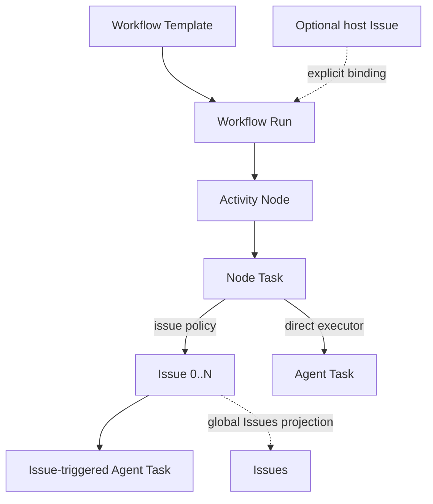
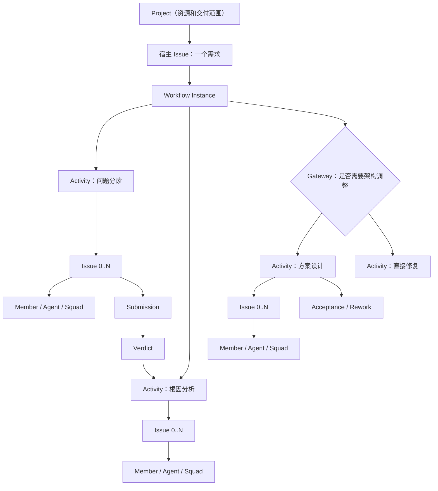

# Workflow — Activity-Container Product and Architecture RFC

> 本文已进入实施。2026-08-02 的架构修订以 §0.0 为准；正文中仍将宿主 Issue 描述为
> 必选的段落，按“兼容的 Issue 绑定模式”理解，不再限制独立 Workflow Run。

## 0.0 2026-08-02 架构修订：Run 是一等对象，Issue 是可选关联

Workflow Template 可以直接启动一个 Workflow Run，也可以从 Issue 启动。两条入口最终
创建同一种 `workflow_instance`；区别只在 `host_issue_id` 是否存在：

- `POST /workflow-templates/{id}/runs` 创建独立 Run，不隐式创建宿主 Issue；
- `POST /issues/{id}/workflow` 保留 Issue 绑定模式；
- `POST /workflow-instances` 保留“原子创建宿主 Issue + Run”的快捷入口；
- Issue 与 Run 的绑定是显式关系，不通过 assignee 模拟。assignee 只表达谁负责执行工作；
- 一个 Issue 同时最多绑定一个非终态 Run；一个 Run 最多有一个宿主 Issue，同时可以在活动中
  产生 `0..N` 个普通 Issue；
- `issue_policy=none` 的活动可以直接向 Agent 或 Squad 创建 Agent Task。该 Task 通过
  `workflow_node_task_id` 归属节点，不制造占位 Issue；
- 需要讨论、拆分、人工协作、评论或外部同步的活动继续使用普通 Issue；
- Workflows 工作台是 Run 的主视图：上方活动地图、下方当前活动的工作投影。纯 Agent 活动
  展示执行主体与任务历史；有 Issue 时复用统一 Issue Surface；“全部工作流 Issue”是同一
  批 Issue 的局部投影，全局 Issues 页面仍是完整事实视图。

新的领域公式：

```text
Workflow Run = 一次模板执行（可选绑定一个宿主 Issue）
Node Task    = 节点内的一份工作定义
Issue        = 需要协作与留痕时采用的工作载体（可选）
Agent Task   = Agent/Squad 的一次执行任务，可由 Issue 或 Node Task 触发
```



## 0. 执行摘要

### 0.1 核心决策

Multica Workflow 采用飞书项目式的**节点流**心智，但不复制其所有配置复杂度：

- Workflow Run 可独立启动或显式绑定一个宿主 Issue；Project 继续只是长期交付、团队和资源上下文。
- Workspace 侧边栏新增与 Issues、Projects 并列的 **Workflows** 一级入口；默认进入运行中
  的 Workflow Instances，而不是模板设置。
- 宿主 Issue 一旦启动 Workflow，详情页采用 **Workflow-first** 布局：流程图是主视图，
  需求基础信息、评论等退到下方内容区，而不是把 Workflow 藏进辅助 Tab。
- 用户可见的业务节点是**活动容器（Activity Node）**，不是 Agent、成员、小队或 Issue。
- 活动节点容纳负责人、参与者、Issue、交付物、排期和完成策略。
- Agent、成员和小队是活动节点的责任/执行策略；节点通过 Executor Resolver 选择实际执行者，
  执行者身份不改变节点语义。
- Issue 是活动节点激活后按需产生的普通工作记录；每个节点可以产生 `0..N` 个 Issue。
- Issue/Agent Task 完成只代表执行结束；节点通过 Submission 接收结构化产出，通过 Verdict
  判断是否准出，整条 Workflow 通过 Acceptance 判断业务是否真正完成或需要返工。
- 需求研发类 Workflow 的 Acceptance 必须表现为画布上的显式验收 Activity；实例级
  Acceptance 记录业务决策，但不制造 End 之后的隐藏阶段。
- 条件、并行、汇聚、等待和结束属于**控制节点（Control Node）**，只编排，不派活。
- 模板发布后不可变；运行实例永久固定在某个模板版本。
- 所有节点实例在启动 Workflow 时创建，但节点内 Issue 只在节点激活时创建。
- Workflow Instance 的宿主 Issue 可空；Node Instance 只绑定 Workflow Instance，并在存在
  宿主时继承宿主和 Project 上下文，不再逐节点绑定宿主。
- Node Instance 是比 Issue 更高一层的“富 Stage”；普通子 Issue 通过 Node Task 归属
  Node Instance，同时仍以宿主 Issue 作为 `parent_issue_id`。
- Workflow Instance / Node Instance 是唯一流程真相；现有 `issue.stage` 只作兼容展示，
  不参与 Workflow 推进。
- 第一版是受控 DAG：支持串行、并行、汇聚和条件分支，不支持任意循环。
- 第一版只实现 Multica Native Workflow，不包含飞书模板导入、实例绑定或节点同步。

### 0.2 最重要的领域公式

```text
Node        = 要发生什么
Executor    = 谁来做，由路由策略解析
Issue       = 用什么工作载体协作和留痕
Agent Run   = Agent 对某个 Issue 或 Node Task 的一次执行尝试
Submission  = 执行者交付的结构化结果
Verdict     = 系统或人对节点是否准出的判断
Acceptance  = 对整条 Workflow 的业务验收，失败时指定返工目标
Transition  = 节点准出后流程走向哪里
```

一句话约束：

```text
Issue 执行工作 -> Submission 交付结果 -> Verdict 判断准出
-> Acceptance 关闭业务或发起返工 -> Workflow 推进/完成
```

### 0.3 推荐形态



## 1. 问题与目标

### 1.1 用户问题

当前 Multica 已能：

- 用父子 Issue 拆解工作；
- 用 `stage` 把同一父 Issue 下的子 Issue 分成有序屏障；
- 把 Issue 分配给成员、Agent 或 Squad；
- 在 Issue 完成时唤醒父 Issue 的 Agent/Squad；

但当前流程是隐式的：

- 没有可复用、可发布、可版本化的声明式 Workflow Template；
- 系统不知道一个阶段后面是否还有阶段；
- `stage` 只能表示整数批次，不能表示名称、责任、交付物、条件、分支和审批；
- Agent 可以动态创建下一阶段，但人类无法在开始前看清标准流程；
- 无法回答“这个需求现在处于哪个业务活动、为什么没有推进、下一步会产生什么工作”；
- `stage` 只是一个整数，无法成为可配置、可审计的活动容器。

### 1.2 用户目标

当团队收到一个复杂需求时，希望：

1. 选择或自动匹配一份标准 Workflow；
2. 打开需求首先看到完整活动路径和当前活动；
3. 每个活动明确责任人、执行人、交付物和完成规则；
4. 选中节点即可查看和操作节点详情，以及限定在该流程内的 Issue；
5. 活动激活时自动生成必要 Issue，并进入统一 Issue 列表；
6. Issue 可交给成员、Agent 或 Squad，继续复用 Multica 现有执行能力；
7. 条件满足后可靠、可解释地推进到下一活动；
8. 流程暂停、失败、回退或服务重启时可恢复，而不是静默卡死。

上述目标对应的典型使用场景见 §3.7；判断一个需求该不该用 Workflow 的准入判据见 §3.8。

### 1.3 成功标准

- 一个管理员能在不理解 BPMN 的情况下配置并发布一份需求 Workflow。
- 一个用户打开需求后 10 秒内能回答：当前活动、负责人、未完成条件、下一步。
- 点击任意节点后，下方只展示该 Workflow 内相关 Issue，不受全局 Issue 筛选器污染。
- 活动 Issue 与普通 Issue 使用同一列表、详情、评论、Agent Run 和 Project 上下文。
- 重复事件、服务重启和多实例并发不会重复创建 Issue 或重复推进节点。
- 修改模板不会改变任何已运行实例。
- Workflow 生成的子 Issue 不会再触发旧 `stage` 机制的重复推进或重复唤醒。

## 2. 非目标

第一版明确不做：

- 完整 BPMN 2.0 兼容；
- 任意脚本节点或在服务端执行用户提供的 JavaScript；
- 任意循环、无限重试和递归子流程；
- 自动迁移运行中的实例到新模板版本；
- 将 Project 改造成 Workflow；
- 将 Workflow 当前节点塞进现有 `Issue.status`；
- 新建另一套任务系统替代 Issue；
- 让 Workflow 直接管理或中断正在执行的 Agent Task；
- 第一版支持跨 Workspace 的节点和 Issue；
- 飞书模板导入、工作项绑定、状态或节点同步。

## 3. 调研结论

### 3.1 三类 Workflow

| 模型 | 节点含义 | 适用场景 | 代表 |
|---|---|---|---|
| 状态流 | 同一个工作项当前状态 | 缺陷、简单任务 | Jira、Linear |
| 业务节点流 | 一段活动，含责任、任务和交付物 | 需求、项目交付 | 飞书项目、Camunda |
| 执行编排流 | 一个可执行函数、工具或 Agent 调用 | 自动化、Agent Runtime | LangGraph、n8n |

Multica 的需求不是简单状态流，也不是纯函数编排。它需要**业务节点流作为产品层，
Issue/Agent Run 作为执行层**。

### 3.2 直接采用的行业原则

- 飞书项目区分节点流与状态流；复杂需求使用节点流，节点关心负责人、交付物和流转，
  并可包含预置子任务：
  <https://www.feishu.cn/content/article/7579926838504410297>
- 飞书项目先定义状态阶段，再把要追踪的事件拆为节点；节点支持前序依赖、条件可见、
  自动/单人/多人完成和节点交付物：
  <https://www.feishu.cn/content/3bv61iew>
- Camunda 将 Task 定义为原子工作，并把 User Task、Service Task、Manual Task 分开；
  assignee/candidate group 是任务属性，不是节点身份：
  <https://docs.camunda.io/docs/components/modeler/bpmn/tasks/>
- Jira/Linear 的 Workflow 更接近一个 Issue 的状态集合，不足以直接表达一个需求下的
  多活动、多任务和多执行者：
  <https://support.atlassian.com/jira-software-cloud/docs/what-are-jira-workflows/>
  <https://linear.app/docs/configuring-workflows>
- LangGraph 证明确定性步骤、Agent 步骤和 Human-in-the-loop 可以存在于同一编排中：
  <https://docs.langchain.com/oss/python/langgraph/overview>

### 3.3 腾讯基于 Multica 的多 Agent Workflow 实践

腾讯技术工程公开的 Multica 阶段性实践进一步验证了本 RFC 的分层，而不是提出另一套
“一节点一 Agent”模型：

- 原文：<https://zhuanlan.zhihu.com/p/2058935265348134625>
- BestBlogs 全文与摘要：<https://www.bestblogs.dev/article/27af35d9>

该实践先比较了三种路线：

1. 一个超级 Agent 包办全流程：边界模糊、难观察、难控制；
2. 直接设计 AI-native Workflow：缺少真实运行数据，容易先做出抽象；
3. 将已知的人类协作流程 Agent 化：先获得稳定流程和可观测数据，再逐步演化。

第一阶段选择第 3 条，与本 RFC “先做 Native Activity Workflow，再基于运行数据演进”
一致。其运行模型明确区分 Workflow Template、Node/Step Instance 和 Issue/Agent Task，
因此不支持“Project 就是 Workflow”“Node 就是 Issue”或“Node 就是 Agent”的建模。

对 Multica 方案最有价值的补充是：

- 平台需要同时具备 Agent 可调度、Workflow 可表达、与执行任务可交接三条主干；
- 节点需要固定执行者、上游指定、能力匹配和兜底等 Executor Resolver；
- 下游不应解析自然语言评论，节点应产生结构化 Submission 和可审计 Verdict；
- Agent Task 完成不等于业务完成，Workflow 需要 Acceptance 和明确返工目标；
- 动态拆解会产生 `0..N` 个子任务，需要稳定的 fan-out 和汇聚语义；
- Reconciler 负责重新计算流程真相，Sweeper 负责发现超时、缺任务和卡死等运行异常；
- Workflows 首页应优先暴露“需要人介入什么”，而不只是陈列运行实例。

本 RFC 吸收上述领域边界和产品信号，但一期仍不引入 Temporal、外部系统交接或飞书同步。
是否更换 Durable Execution 基础设施，应在 Native Engine 获得真实吞吐、重试、超时和
返工数据后单独评估。

该实践中反复出现、且直接约束本 RFC 设计的五条经验：

| 踩到的问题 | 结论 |
|---|---|
| 下游解析上游自然语言评论，输出不稳定 | 用结构化字段（verdict / reasoning / confidence）传递，而不是让下游读人话 |
| 早期假设流程是线性的 | 需要 fan-out / fan-in，一个活动可以产生 `0..N` 个下游工作 |
| Agent 报完成但业务没完成 | 执行与准出分离，驳回要能指定返工目标节点 |
| 卡住时静默无声 | 显式阻塞标记 + 超时探测 + 自动恢复 sweeper，失败要可见可恢复 |
| 交接时上下文丢失 | 上游预置结构化上下文字段，而不是靠人复述 |

其总结的一句话是：瓶颈不在每个人是否用了 AI，而在系统是否按 AI 的协作方式设计。

### 3.4 上游开源主干已具备的执行能力

- 参考：<https://github.com/Askhz/multica>

上游 README 描述的主干能力是**执行层**而非编排层：

- Issue 可以像派给同事一样派给 Agent，Agent 自主取活、写代码、报阻塞、改状态；
- Squad 由 leader Agent 统一分派，团队规模变大后路由仍然稳定；
- Skill 让一次性解法沉淀为可复用能力；
- Runtime 统一管理本地 daemon 与云端运行时，WebSocket 实时回传进度；
- Workspace 级隔离与多 Agent Provider（Claude Code、Codex、Copilot CLI、Gemini 等）。

对本 RFC 的意义是**划清边界**：单个活动内部“谁来做、怎么做、怎么回报”已经被现有
Agent / Squad / Skill / Runtime 解决，Workflow 不重造执行层。Workflow 只补三件现有
能力不覆盖的事：

1. 多个活动之间的**顺序、并行、条件与汇聚**；
2. 活动的**准出判据**（Submission + Verdict），而不是“Agent Task 结束即通过”；
3. 整条流程的**业务验收与返工**（Acceptance）。

### 3.5 社区诉求：Workflow Orchestration（Issue #1943）

- 参考：<https://github.com/multica-ai/multica/issues/1943>

该 issue 记录了在没有原生 Workflow 时用户实际采用的三种 workaround，以及它们各自的失效
方式：

| Workaround | 失效方式 |
|---|---|
| 用 Skill 的 prompt 维持流程状态 | 依赖模型是否照做，不可靠、不可审计 |
| 轮询式编排 | 复杂、低效，状态散落在各处 |
| 外接 n8n / 飞书工作流 | 流程真相在平台之外，运维成本高，Issue 与流程割裂 |

其提出的诉求可分为两类。**一期已覆盖**：引擎强制的状态机（而不是 prompt 约定）、
if/else 条件分支、人工审批门、测试结果类条件、超时与人工介入、可视化编排界面。
**一期不覆盖、记录为后续**：事件触发器（Issue 创建、状态变化、Agent 输出、CI 结果自动
拉起 Workflow）、Webhook / CLI 命令类节点。后者属于把 Workflow 变成通用自动化引擎的方向，
与 §2 非目标中“不做任意脚本节点”一致，应在 Native Activity Workflow 跑出真实数据后
单独立项。

该 issue 给出的典型例子——PM Agent → Research Agent（条件触发）→ Coding Agent →
Review Agent（pass/fail）→ QA Agent——已并入 §3.7 场景 D。

### 3.6 外部参考索引

| 来源 | 链接 | 提供了什么 |
|---|---|---|
| 社区诉求 Issue #1943 | <https://github.com/multica-ai/multica/issues/1943> | 用户在没有 Workflow 时的 workaround 与失效方式、期望的节点类型与触发方式、一条典型 Agent 流水线 |
| 上游开源主干 README | <https://github.com/Askhz/multica> | 已有执行层能力（Issue 派单、Squad、Skill、Runtime），用于划清 Workflow 的职责边界 |
| 腾讯基于 Multica 的实践（原文） | <https://zhuanlan.zhihu.com/p/2058935265348134625> | 四类真实运行的场景、踩坑清单与设计原则 |
| 同上（BestBlogs 全文与摘要） | <https://www.bestblogs.dev/article/27af35d9> | 同上，便于检索的镜像 |

### 3.7 典型使用场景

以下五个场景由 §3.3、§3.4、§3.5 的外部参考归纳得到，全部是已有真实运行或真实诉求的
流程，不是为覆盖能力而虚构的例子。它们共同定义一期的验收范围：一期引擎必须能表达
场景 A–D，场景 E 用于验证 fan-out 语义。

#### 场景 A：需求交付主流水线

| 项 | 内容 |
|---|---|
| 触发 | 人提出一个需求 Issue，选择或自动匹配需求交付模板 |
| 活动路径 | 需求评估 → 拆分与派活 → 实现 → 完成通知 → 验收 |
| 关键分支 | 评估结论为“信息不足”时回到提出人补充；验收不通过时返工到实现或拆分节点 |
| 准出 | 评估节点产出结构化结论（可做/不可做/待澄清 + 理由）；实现节点产出交付物引用；验收节点产出 Acceptance |
| 为什么必须是 Workflow | 父子 Issue + `stage` 只能表达“第几批”，无法表达“评估结论决定后面怎么走”，也无法在需求打开时告诉人当前卡在哪、下一步会产生什么工作 |

#### 场景 B：缺陷闭环

| 项 | 内容 |
|---|---|
| 触发 | 测试或用户提交缺陷 |
| 活动路径 | 问题分诊 → 根因分析 → 修复 → 状态回写 → 测试验证 |
| 关键分支 | 分诊判定为“非缺陷/重复/需求变更”时直接结束；验证不通过时返工到修复节点 |
| 准出 | 根因分析产出结构化结论；验证节点由测试角色或自动化用例给出 Verdict |
| 业务价值 | 参考实践中最直接的收益是**测试可以自己闭掉一部分缺陷环**，不必排队等开发认领——流程由系统推进，而不是靠人盯 |

#### 场景 C：平台自治与自我改进

| 项 | 内容 |
|---|---|
| 触发 | 线上问题、告警或积压的平台自身待办 |
| 活动路径 | 问题发现 → 诊断 → 方案设计 → 修改 → 验证 → 运维确认 |
| 关键分支 | 诊断结论决定走“直接修复”还是“先出方案设计”；运维确认是显式的人工门 |
| 准出 | 方案设计节点产出设计交付物并需人工 Verdict；运维确认节点不可由 Agent 自动通过 |
| 为什么必须是 Workflow | 这是长链路、跨昼夜、含强制人工卡点的流程，最需要“暂停/超时/重启后可恢复”和显式阻塞标记 |

#### 场景 D：多 Agent 研发流水线与质量门

| 项 | 内容 |
|---|---|
| 触发 | 已明确的开发任务进入流水线 |
| 活动路径 | PM Agent 澄清 → （条件）Research Agent 调研 → Coding Agent 实现 → Review Agent 评审 → QA Agent 验证 |
| 关键分支 | 是否需要调研由澄清结论决定；Review pass/fail 决定继续还是打回 Coding |
| 准出 | 每个节点产出结构化 Submission；Review 与 QA 的 Verdict 是硬性准出门 |
| 为什么必须是 Workflow | 这正是 Issue #1943 里用户目前靠 Skill prompt 或外接 n8n 拼出来的东西——流程约束必须由引擎强制，而不是指望每个 Agent 都遵守提示词里的约定 |

#### 场景 E：存量 Issue 池的批量处理

| 项 | 内容 |
|---|---|
| 触发 | 定期从低优先级积压中抽取一批 Issue |
| 活动路径 | 批量抽取 → fan-out 到每条 Issue 的处理活动 → 汇聚 → 批次汇报 |
| 关键分支 | 单条处理失败不阻塞整批；汇聚节点按“全部完成”或“达到阈值”推进 |
| 准出 | 汇聚节点需要稳定的 fan-out / fan-in 语义（见 §6.5、§7.7） |
| 为什么必须是 Workflow | 一个活动产生 `0..N` 个下游工作，且需要在不确定数量的情况下可靠汇聚——这是父子 Issue 结构完全无法表达的 |

场景与一期能力的对应关系：

| 能力 | A | B | C | D | E |
|---|---|---|---|---|---|
| 条件分支 | ✓ | ✓ | ✓ | ✓ | |
| 人工审批门 | ✓ | | ✓ | | |
| 结构化 Submission + Verdict | ✓ | ✓ | ✓ | ✓ | ✓ |
| Acceptance 与返工目标 | ✓ | ✓ | ✓ | ✓ | |
| fan-out / fan-in | ✓ | | | | ✓ |
| 超时与阻塞可见 | ✓ | ✓ | ✓ | ✓ | ✓ |

### 3.8 场景准入判据

不是所有工作都值得建 Workflow。满足以下**任意两条**才建议用 Workflow，否则用现有能力：

1. 涉及两个以上**责任不同**的活动，而不只是同一件事的多个状态；
2. 中间存在**条件分支**：某个活动的结论会改变后面的走向；
3. 存在**准出判断**：上一环节“做完了”不等于“可以进入下一环节”；
4. 存在**跨角色交接**，且交接内容需要结构化，而不是一句评论；
5. 需要**返工**：失败时要退回某个特定活动，而不是整体重来。

反例——以下情况不要用 Workflow：

| 情况 | 应该用 |
|---|---|
| 单人单步完成，只是状态在变 | Issue + `status` |
| 固定顺序、无分支、无准出判断的几个子任务 | 父子 Issue + `stage` |
| 纯确定性的函数/工具调用编排，没有人和责任 | Skill 或脚本 |
| 只想让一个 Agent 端到端把活干完，且过程不需要观察 | 直接派单给 Agent 或 Squad |

## 4. 领域模型

### 4.1 实体层级

```text
Workflow Template
└── Workflow Template Version（发布后不可变）
    ├── Role Definitions
    ├── Activity Node Definitions
    │   ├── Issue Templates
    │   ├── Submission Schema
    │   ├── Verdict Policy
    │   └── Completion Policy
    ├── Control Node Definitions
    └── Edges / Conditions

Host Issue
└── Workflow Instance（固定到一个 Template Version）
    ├── Role Assignments
    ├── Node Instance / Attempt
    │   ├── Rich Stage Context
    │   ├── Participants
    │   ├── Executor Resolution
    │   ├── Node Task
    │   │   └── Materialized Child Issue（parent = Host Issue）
    │   ├── Submissions
    │   ├── Verdict
    │   └── Confirmations
    ├── Acceptance / Rework
    └── Workflow Events / Audit
```

这里有三个重要边界：

1. **Workflow Instance 是最高的运行实例**，表示一个需求正在跑哪一版流程；
2. **Node Instance 高于 Issue**，是带名称、责任、条件和交付物的富 Stage；
3. **Node Instance 不创造中间父 Issue**。它下面的执行 Issue 仍直接以 Host Issue 为父，
   通过 Node Task binding 获得节点归属。

因此运行时不是：

```text
Host Issue -> Node Parent Issue -> Child Issue
```

而是：

```text
Host Issue
├── Workflow Instance
│   └── Node Instance（Rich Stage）
│       └── Node Task -> Child Issue
└── Child Issues（普通 Issue 关系和列表投影）
```

如果某个节点确实需要一张“统筹 Issue”，它应当是该节点模板显式声明的主任务，而不是
每个 Node Instance 自动生成的系统父 Issue。

同一批数据提供两种投影：

```text
Issue 投影：     Parent/Host Issue -> Child Issues
Workflow 投影：  Workflow Instance -> Node Instances -> Bound Child Issues
```

用户在全局 Issue 列表里看到任务关系，在 Workflow-first 工作台里看到活动阶段关系；
两边引用同一批 Issue，不复制数据。

### 4.2 Workflow Template

可复用流程的逻辑身份，例如：

- 产品需求研发流程；
- 缺陷自动修复流程；
- 技术债治理流程。

Template 本身只保存名称、说明、适用对象和生命周期；真正运行定义位于 Version。

### 4.3 Workflow Template Version

一份不可变的发布快照，包含：

- 稳定 node key；
- 活动节点和控制节点；
- 连线、前序和条件；
- 角色定义；
- Issue 模板；
- 输入/输出 Schema；
- 节点完成策略；
- 宿主 Issue 状态策略；
- 编辑器布局信息。

发布版本不可修改。编辑已发布模板时，系统从最新发布版本 fork 新 Draft，重新发布后
生成下一个版本。运行实例不自动升级。

### 4.4 Workflow Instance

一个宿主 Issue 上实际运行的流程，也是宿主绑定的唯一位置。

- 第一版同一宿主 Issue 同时最多一个非终态实例；
- 可以保留多个历史实例；
- 实例固定 `template_version_id`；
- 保存启动时输入和角色解析结果；
- 状态为 `needs_setup | running | paused | completed | cancelled | failed`。

Node Instance 不保存第二份 `host_issue_id`。查询宿主时通过 Workflow Instance 获取，
避免回退、复制或修复时出现“节点宿主”和“流程宿主”不一致。

### 4.5 Activity Node Definition

用户看到的业务活动容器。示例：问题分诊、根因分析、方案设计、代码实施、验收。

活动节点包含：

- 名称、说明和展示色；
- 负责人/参与者角色；
- Issue 模板 `0..N`；
- 是否允许节点激活后动态添加 Issue；
- 交付物 Schema；
- 完成策略；
- 可见条件；
- 排期策略；
- 失败/超时策略；
- 进入和完成时的受控动作。

活动节点**不等于执行者，也不等于 Issue**。

### 4.6 Control Node Definition

只负责流程结构，不承载业务工作：

- `start`
- `gateway`：条件分支；
- `parallel_split`
- `parallel_join`
- `wait`：第一版仅保留模型，执行延后；
- `end`

控制节点不分配负责人、不创建 Issue、不进入 Issue 列表。需求详情默认将其折叠为连线、
分叉和汇聚标识。

### 4.7 Node Instance / Attempt

Activity/Control Node 在一个 Workflow Instance 中的一次运行记录。对 Activity 而言，
它就是现有 `stage` 概念的上位替代：不仅有顺序，还拥有名称、责任、任务、交付物、
完成规则和审计历史。

使用 attempt 而不是简单 `(instance, node_key)` 唯一，是为了支持回退：

```text
方案设计 attempt 1 -> completed
代码实施 attempt 1 -> superseded
方案设计 attempt 2 -> active
```

节点状态：

```text
pending
  -> ready
  -> active
  -> waiting
  -> completed

active/waiting -> blocked
active/waiting -> failed
pending/active/waiting -> skipped
active/waiting/completed -> superseded（回退产生新 attempt）
* -> cancelled（Workflow 终止）
```

其中：

- `pending`：前序未满足；
- `ready`：前序满足，等待激活事务；
- `active`：可执行工作已产生；
- `waiting`：等待交付物、确认或异步 Issue materialization；
- `blocked`：规则明确阻塞，需要处理；
- `failed`：引擎动作失败，不表示某个 Agent Run 失败；
- `superseded`：因回退被历史化。

### 4.8 Node Task

Activity Node 内的一项可物化工作。来源有两种：

- 模板预置任务；
- 节点激活后由成员或 Agent 动态创建的任务。

Node Task 先于 Issue 存在，负责可靠 materialization：

```text
pending_materialization
  -> materializing
  -> materialized

materializing -> pending_materialization（可重试）
materializing -> failed（超过重试阈值）
* -> cancelled
```

每个 Node Task 最多绑定一个普通 Issue。若回退后再次进入同一节点，使用新 Attempt 和
新 Node Task，不复用或重开旧 Issue，历史保持可解释。

### 4.9 Participant 和 Role

Template 引用流程角色，不强耦合某个 Workspace 的具体 UUID：

```text
product_owner
root_cause_owner
implementation_squad
acceptance_approver
```

启动实例时，角色解析为实际 Actor：

- `member`
- `agent`
- `squad`

第一版支持以下解析方式：

1. 模板固定默认 Actor；
2. 宿主 Issue 当前 assignee；
3. 启动时由用户选择；
4. 复用另一个流程角色的 Actor。

Capability 自动匹配保留为后续能力。现有
`workspace_agent_capability` 是封闭能力集合，不能未经设计直接变成任意 Workflow
capability registry。

角色未解析时，实例进入 `needs_setup`，不创建执行 Issue，也不猜测负责人。

Role Assignment 回答“这个流程角色是谁”，Executor Resolver 回答“这一次 Node Task
实际交给谁”。前者是实例上下文，后者是运行决策；即使 Resolver 最终选择某个 role，
也必须保存当时解析到的 Actor 快照。

### 4.10 Executor Resolver

Node Owner 负责活动结果，Executor 负责具体任务，两者可以相同也可以不同。模板不把
Activity Node 固化为某个 Agent，而是为节点或 Node Task 声明有序解析策略：

1. `fixed_role`：使用模板角色或启动时已解析 Actor；
2. `previous_selected`：读取上游已校验 Submission 中指定的 Actor；
3. `capability_match`：从允许的 Agent/Squad 池按能力、可用性和租户范围匹配；
4. `fallback_role`：前述策略无结果时使用兜底角色；
5. `manual`：进入 `needs_setup`，等待 Member 选择，不静默猜测。

每次解析保存策略、候选、选择结果和原因快照，后续角色配置变化不改写正在运行的
Node Attempt。第一版只实现 `fixed_role | fallback_role | manual`；
`previous_selected | capability_match` 在 Phase 3 增加。

### 4.11 Node Submission 和 Verdict

Submission 是一次节点交付，不等于 Issue comment，也不等于 Agent Run 的原始文本：

- 属于一个 Node Instance Attempt；
- 记录提交者、结构化 payload、摘要和关联 Issue/Run；
- payload 必须通过节点 `submission_schema`；
- 同一 Attempt 可有多次提交，旧版本只读保留；
- Agent、Member、Squad 代表都可提交，但权限由节点策略限制。

Verdict 是对当前有效 Submission 集合的准出判断：

```text
pass | fail | blocked
```

Verdict 保存 reason、confidence、evidence 和 evaluator。Evaluator 可以是确定性规则、
指定 Member，未来也可以是受控 Judge Agent。第一版的自动 Verdict 只使用确定性规则；
Agent 生成的建议不能伪装成人工或系统事实。

多 Issue 节点不要求“一张 Issue 对应一个 Verdict”。节点级聚合器读取所有 required
Node Task 的终态和有效 Submission，形成唯一的当前 Verdict；新 Submission 会产生新
Verdict revision，但不会覆盖历史。

### 4.12 Workflow Acceptance

Acceptance 是整条 Workflow 的业务闭环，不是“最后一个 Agent Task 已结束”的别名：

- `approved`：业务验收通过，Workflow 可以 completed；
- `rejected`：必须填写原因和 `rework_target_node_key`，创建目标节点的新 Attempt；
- `changes_requested`：与 rejected 相同地进入返工，但语义对用户更友好；
- `blocked`：缺少外部决策或条件，Workflow 保持 waiting/blocked。

模板可设置 `acceptance_policy=none | member | node_verdict`。没有正式业务验收的流程可用
`none`；需求研发类模板默认使用 Member 验收，并且必须把它配置为画布上的显式“验收”
Activity。UI/QA/产品等验收都仍是 Activity；实例级 Acceptance 聚合最终业务决定并关联
触发它的验收 Node Attempt，避免把关闭状态藏在某张 Issue 中，也避免 End 之后再出现
用户看不见的流程阶段。

第一版不允许 Agent 独立作出正式 Member Acceptance；Agent 可以提交验收建议和证据。

### 4.13 Issue

Workflow 生成的 Issue 仍是完整普通 Issue：

- 出现在全局 Issues 和 Project Issues；
- 使用原有 status、priority、comments、attachments、labels 和 properties；
- 可分配给成员、Agent 或 Squad；
- Agent/Squad assignee 继续触发现有 IssueService / TaskService；
- `parent_issue_id` 指向宿主 Issue；
- `project_id` 默认继承宿主 Issue；
- 通过 Node Task binding 找回所属 Workflow / Node；
- 在 UI 上增加 Workflow 和 Node chip。

Workflow 不新增第二套任务列表。

新 UI 按 Node Task binding 分组 Issue，不按 `issue.stage` 反推节点。为兼容旧客户端，
materializer 可以把 Node 的稳定展示序号投影到 `issue.stage`，但该整数不参与推进。

## 5. Template Definition Contract

### 5.1 JSON 形态

模板版本作为一份不可变、服务端严格校验的 JSONB 文档保存。运行数据使用标准化表，
模板图使用 JSONB，理由是：

- 发布和回滚是整份原子快照；
- 模板导出、审阅和版本 diff 更自然；
- 新增可选节点配置不需要频繁修改多张定义表；
- 运行查询不依赖在 JSONB 中扫描动态状态。

示例（仅说明契约，不是最终 API 全量字段）：

```json
{
  "schema_version": 1,
  "name": "产品需求研发流程",
  "applies_to": {"kind": "issue", "type_key": "requirement"},
  "roles": [
    {
      "key": "product_owner",
      "name": "产品负责人",
      "required": true,
      "allowed_actor_types": ["member"]
    },
    {
      "key": "implementation_squad",
      "name": "实施小队",
      "required": true,
      "allowed_actor_types": ["squad"]
    },
    {
      "key": "acceptance_approver",
      "name": "验收人",
      "required": true,
      "allowed_actor_types": ["member"]
    }
  ],
  "nodes": [
    {
      "key": "triage",
      "kind": "activity",
      "name": "问题分诊",
      "owner_role": "product_owner",
      "executor": {
        "strategies": [
          {"kind": "fixed_role", "role": "product_owner"},
          {"kind": "fallback_role", "role": "implementation_squad"},
          {"kind": "manual"}
        ]
      },
      "issue_templates": [
        {
          "key": "clarify_scope",
          "title": "问题分诊：{{host.title}}",
          "assignee_role": "product_owner",
          "required": true,
          "initial_status": "todo"
        }
      ],
      "submission_schema": {
        "fields": [
          {"key": "impact_scope", "name": "影响范围", "type": "text", "required": true},
          {"key": "architecture_change", "name": "需要架构调整", "type": "boolean", "required": true}
        ]
      },
      "verdict": {
        "evaluator": "deterministic",
        "required_result": "pass"
      },
      "completion": {
        "required_issue_outcome": "done",
        "submission_required": true,
        "verdict_required": "pass",
        "confirmation": "owner_any"
      }
    },
    {
      "key": "need_architecture_change",
      "kind": "gateway",
      "name": "是否需要架构调整"
    }
  ],
  "edges": [
    {"from": "start", "to": "triage"},
    {
      "from": "triage",
      "to": "need_architecture_change"
    },
    {
      "from": "need_architecture_change",
      "to": "solution_design",
      "condition": {
        "source": "node_submission",
        "node": "triage",
        "key": "architecture_change",
        "op": "eq",
        "value": true
      }
    },
    {
      "from": "need_architecture_change",
      "to": "direct_fix",
      "default": true
    }
  ],
  "acceptance": {
    "policy": "member",
    "approver_role": "acceptance_approver",
    "rework_targets": ["solution_design", "implementation"]
  },
  "layout": {
    "nodes": {
      "triage": {"x": 160, "y": 120},
      "need_architecture_change": {"x": 420, "y": 120}
    }
  }
}
```

### 5.2 模板校验

发布前服务端必须验证：

- `schema_version` 已知；
- node key、task key、role key 在版本内唯一且发布后稳定；
- 恰好一个 start，至少一个 end；
- 所有节点可从 start 到达；
- 所有非 end 节点存在出边；
- 第一版图必须为 DAG；
- gateway 至少两条出边，最多一条 default；
- parallel join 明确 `all` 或 `any`；
- activity 的 owner/assignee role 必须存在；
- executor strategy 引用的 role/capability 必须存在，并且有 `manual` 或合法 fallback；
- role 的 `allowed_actor_types` 只能包含 `member | agent | squad`，且至少一个；
- Issue template status/priority/assignee pair 合法；
- 标题模板只使用允许变量；
- completion 引用的 submission field/task/verdict 存在；
- submission schema 的 field key 唯一且类型受支持；
- deterministic verdict 只能引用结构化 task/submission/host 字段；
- acceptance approver 必须解析为 Member，所有 rework target 可达且为 Activity；
- `owner_any | owner_all` 只允许引用保证解析为 Member 的 owner role；如果 owner
  可能是 Agent/Squad，模板必须改用显式 Member 审批角色或取消正式 confirmation；
- 条件只使用受支持的结构化操作符；
- 不允许任意代码、正则灾难表达式或未知数据源；
- 定义大小和节点/任务数量受服务端上限保护；
- 前端校验只用于即时反馈，服务端校验是权威。

### 5.3 条件 DSL

第一版不执行脚本，只支持结构化条件：

- 数据源：宿主 Issue 标准字段、宿主 properties、已完成节点的有效 Submission/Verdict；
- 操作符：`eq | neq | in | not_in | is_set | is_not_set | gt | gte | lt | lte`；
- 组合：`all | any | not`；
- 未知/缺失字段 fail closed；
- 每个 gateway 必须有 default 路径，避免实例永久悬空。

## 6. Activity Node Contract

### 6.1 责任分层

```text
Node Owner
  负责活动能否结束、交付物是否完整、是否回退

Node Participant
  参与活动，但不必拥有具体 Issue

Issue Assignee
  负责一个具体工作项

Submission Author
  对节点提交结构化结果和证据

Verdict Evaluator
  判断节点是否达到准出标准

Approver
  对节点或整条 Workflow 给出人类确认
```

这些角色可以相同，也可以不同。

### 6.2 Issue 生成策略

活动节点配置：

- `none`：不生成 Issue，只收集交付物/确认；
- `fixed`：激活时生成模板预置 Issue；
- `dynamic`：不预置，激活后由节点负责人/Agent 动态拆解；
- `fixed_and_dynamic`：先生成固定清单，再允许追加。

推荐默认：

- 分诊、分析、实现：`fixed_and_dynamic`；
- 人工审批：`none`；
- 里程碑：控制节点，不是 Activity。

### 6.3 Submission 策略

节点声明 `submission_schema`，而不是要求下游从 Issue comment 或 Agent 文本中猜结果：

- `none`：节点没有独立交付物；
- `single`：一个当前有效 Submission；
- `per_required_task`：每个 required Node Task 至少一个有效 Submission；
- `fan_in`：允许多个子任务提交，节点聚合为一份结果。

Submission 可以引用原始 Issue、Agent Run、附件和评论作为 evidence，但这些引用不能
代替结构化字段校验。更新交付物采用新增 revision，不就地覆盖历史。

### 6.4 Verdict 与完成策略

节点完成由多个谓词 AND 组合：

```text
required Issue outcome
+ required Submission
+ required Verdict
+ confirmation policy
+ optional structured condition
= node completed
```

第一版支持：

- 必需 Issue：
  - `done`：必须全部 Done；Cancelled 视为阻塞；
  - `terminal`：Done 或 Cancelled 均算结束，仅适合显式配置；
  - `none`：忽略 Issue；
- Submission：满足策略，所有 required field 已通过类型校验；
- Verdict：
  - `none`：不要求独立判断；
  - `pass`：当前 Verdict 必须为 pass；
  - `not_blocked`：pass/fail 都可沿结构化分支继续，仅 blocked 停止；
- 确认：
  - `none`
  - `owner_any`
  - `owner_all`
  - `member_any`
  - `member_all`
  - `admin_only`
- 人工确认可填写 comment；管理员强制完成、跳过或回退必须填写 comment；
- `owner_any | owner_all` 中的 owner 特指解析为 Member 的节点负责人；
- Agent/Squad 可以拥有节点、提交 Issue 和交付物，但第一版的正式确认只能由 Member
  完成；需要人审时应配置显式 Member 审批角色。

Issue 对应 Agent Run 失败不会自动使 Node failed。Agent Run 可以重试、产生 Submission
建议、评论或让 Issue 进入 blocked；Workflow 只判断持久化后的 Issue、Submission、
Verdict 与 Node 状态。

### 6.5 动态 Issue 与 fan-out

活动节点激活后，负责人或具备权限的 Agent 可以在节点内创建额外 Issue：

- 自动绑定到当前 Node Attempt；
- 默认继承宿主 parent/project；
- required 默认为 false；
- 将动态 Issue 改为 required 需要 Node Owner 或管理员确认；
- 已完成节点不能追加 Issue，除非先回退或重新打开节点 Attempt。

一个 Submission 可以声明结构化的 `proposed_tasks`，由有权限的 Member 或受控策略确认后
批量创建 Node Task。fan-out 使用稳定 task key 和幂等 origin；节点只有在全部 required
分支完成并汇聚后才可形成 pass Verdict。第一版 Phase 2 只支持模板固定任务，动态
fan-out 放入 Phase 3。

## 7. Runtime 语义

### 7.1 启动

启动事务：

1. 验证宿主 Issue 与模板版本属于同一 Workspace；
2. 验证没有另一个非终态 Workflow；
3. 创建 Workflow Instance；
4. 创建 Role Assignment；
5. 为模板内全部节点创建初始 Node Instance attempt 1，状态 pending；
6. 激活 start 后可达节点；
7. 写 Workflow Event；
8. 提交事务；
9. 发布 Workflow WS 事件；
10. Materializer 创建首批 Node Task 对应 Issue。

角色缺失时只执行 1–5，实例进入 `needs_setup`。

### 7.2 激活活动节点

1. 锁定 Workflow Instance；
2. 确认所有进入条件成立；
3. Node `pending -> ready -> active/waiting`；
4. 解析节点参与者；
5. Executor Resolver 按策略链解析 Node Task 执行者并保存决策快照；
6. 为固定 Issue 模板创建 Node Task；
7. 无法解析且没有 fallback 时将实例置为 `needs_setup`、节点置为 `blocked`，不猜测 Actor；
8. 写审计事件；
9. 提交；
10. 异步但立即唤醒 materializer。

未来节点在启动时已有 Node Instance，但不会提前创建 Node Task 或 Issue。

### 7.3 Materialization

Node Task materializer：

1. 使用 `FOR UPDATE SKIP LOCKED` claim pending task；
2. 校验 Node Attempt 仍 active/waiting；
3. 调用 IssueService 创建普通 Issue；
4. Issue 使用：
   - `origin_type = workflow`
   - `origin_id = workflow_node_task.id`
   - `parent_issue_id = host_issue_id`
   - `project_id = host project`
   - `stage = activity display ordinal`（仅兼容展示）
5. 更新 Node Task `issue_id` 和 materialization 状态；
6. 发布原有 `issue:created` 与新的 workflow node event；
7. 继续由现有 IssueService 决定是否触发 Agent/Squad Run。

为防止“创建 Issue 成功、写 binding 前进程崩溃”：

- `(origin_type, origin_id)` 对 `origin_type='workflow'` 建唯一索引；
- 重试先按 origin 查找，找到则只修复 binding；
- IssueService 的所有现有 side effect 仍只有一次；
- materializer 是可重复执行的调和器，不依赖一次性消息。

### 7.4 Issue 状态变化

快速路径：

- `issue:updated` 监听器发现 Issue 有 Workflow binding 且 status changed；
- 请求 Workflow Reconciler 对所属 Node Attempt 重新求值。

正确性不能依赖当前内存 EventBus，因为它是进程内同步总线且不持久化。恢复路径：

- 周期 worker 扫描 active/waiting/blocked Node Attempt；
- 对比 bound Issue `updated_at` 与 `last_reconciled_at`；
- 重新计算完成谓词；
- 重复事件只得到同一结果。

### 7.5 Submission、Verdict 和节点推进

Reconciler 在事务内：

1. 使用 instance-scoped advisory lock 或 row lock；
2. 重载 Node、Task、Issue、Submission、Verdict、Confirmation；
3. 校验当前有效 Submission；无效时保存字段级 waiting reason；
4. 运行确定性 Verdict evaluator，必要时生成新 Verdict revision；
5. 重新计算 completion；
6. 若未完成，只更新解释性 `waiting_reasons`；
7. 若完成，CAS 更新 Node 为 completed；
8. 计算出边；
9. gateway 只读取已校验 Submission/Verdict/宿主字段，选择唯一合法路径；
10. 不选中的条件分支标记 skipped；
11. 激活后继节点，或进入 Workflow Acceptance；
12. 写 append-only Workflow Event；
13. 提交后发布 WS 事件。

所有推进操作以 `(instance_id, node_key, attempt, transition_key)` 做幂等保护。

自然语言 Agent 输出不能被下一节点或 gateway 直接解析。Agent 必须通过 Submission API
提交符合 Schema 的字段；原始文本只作为 evidence/summary 展示。

### 7.6 Workflow Acceptance 与返工

Acceptance 发生在画布上的显式验收 Activity，而不是 End 之后：

1. `acceptance_policy=none`：普通 Activity 准出并到达 End 后直接完成；
2. `node_verdict`：显式验收 Activity 的最新 Verdict 为 pass 后准出；
3. `member`：激活显式验收 Activity 时创建 pending Acceptance，等待指定 Member；
4. approved 后验收 Activity 完成，并沿可见连线到 End；
5. rejected/changes_requested 必须携带原因和允许的 rework target；
6. 当前验收 Node Attempt 标记 superseded，从目标 Activity 创建新 Attempt；
7. 旧 Issue、Submission、Verdict 和 Acceptance 全部只读保留。

Acceptance 重放使用 `idempotency_key`；同一 revision 只能产生一个生效决策。正式人工
Acceptance 永远记录 Member identity，Agent 建议写入 evidence。

### 7.7 并行与汇聚

- split 激活多条分支；
- join `all`：所有被选择的前序分支完成/跳过后进入；
- join `any`：第一条成功分支到达后进入，其余活动默认继续，不隐式取消；
- 第一版不提供 race-and-cancel，避免把 Workflow 完成和 Agent Task 中断错误耦合。

### 7.8 回退

第一版支持受控回退到已完成 Activity：

1. 只有 Node Owner、Workspace admin/owner 可执行；
2. 必须填写原因；
3. 从当前路径到目标后的活动标记 superseded；
4. 不停止进行中的 Agent Run；
5. 为目标 node_key 创建新 attempt；
6. 新 attempt 创建新的 Node Task，但**复用上一 attempt 的 Issue**：把它置回 `todo`
   并重新唤醒执行者，而不是新建一个；
7. 历史轨道显示 attempt。

#### 7.8.1 为什么改为复用 Issue

本 RFC 初版规定新 attempt 新建 Issue，理由是"更清晰，也避免 Agent 在旧上下文上继续
执行"。测试环境实跑一条缺陷流水线（人工回滚一次）后，这条规定被推翻，依据是三点实测：

- **产生孤儿。** attempt 1 的 Issue 随节点 superseded 后仍停在 `in_review`、仍挂着
  assignee，没有任何东西收尾它。一次回滚就留下一对同名 Issue。
- **丢上下文。** 新 Issue 的描述是模板原文，与 attempt 1 逐字相同。执行者看不到自己
  上一轮做了什么、也看不到驳回它的评审结论，只能从头重做。
- **与领域切分矛盾。** attempt 已经由 Node Instance 承载；再让 Issue 表达"第几次"，
  等于把同一语义放进两个实体，正是 §8.1 拒绝复用 `stage` 时给的理由。Issue 在本 RFC
  里的定位是协作载体（§4.13），不是不可变执行记录。

初版担心的"Agent 在旧上下文上继续执行"是真实风险，但解法不是把上下文藏起来，而是
明确告诉执行者哪部分该改——见 §7.8.2。

#### 7.8.2 Rework 上下文

复用 Issue 后，执行者手上多了上一轮产出，但 Issue 本身说不出"这是重做"和"为什么被
退回"。这两条通过任务上下文的 `rework` 块下发，在 brief 中渲染为独立段落：

```text
Rework = { attempt, source, reason }
source ∈ { acceptance（验收驳回）, manual_rollback（人工回滚） }
```

约束：

- 第一次执行不下发该块；
- 理由缺失时如实渲染"未填写"，不伪造，并提示执行者先问清楚再动手；
- 该块排在上游结论之前——重跑时上游没有变化，变的是这条判断。

未落地、留待后续：驳回理由目前是自由文本。实测中一次真实回滚填的是"有些点没有想到"，
管道通了但内容不可执行。应改为结构化三问（哪条验收标准未过、期望 vs 实际、建议改哪里），
与 §4.11 Verdict 的"结构化产出"要求一致。

### 7.9 暂停、取消和删除

- Pause：不激活新节点；现有 Issue 和 Agent Run 不被取消。
- Cancel Workflow：所有非终态 Node 标记 cancelled；Issue 不删除，默认保持原状态。
- Published Template：只允许 archive，不物理删除。
- Runtime records：只保留审计，不提供普通用户物理删除。
- 删除宿主 Issue：应用层事务先取消并清理 Workflow 关联，再删除 Issue。
- 删除 active required Workflow Issue：返回 409，引导用户 Cancel Issue 或显式从节点解绑。
- 修改 Workflow Issue 的 `parent_issue_id`：active binding 下禁止；必须先显式 detach。

### 7.10 超时和改派默认值

- 节点/任务超时默认只创建 intervention 和通知，不自动 fail、skip、cancel 或回退；
- 未物化 Node Task 改派时新增 Executor Resolution，随后使用新 Actor materialize；
- 已物化 Issue 改派复用现有 Issue assignee 更新路径，不复制第二套 assignee；
- 改派只影响当前 Node Attempt，不修改 Published Template；
- 已产生的 Submission/Verdict 保留原作者和 evaluator，不随改派转移身份；
- 健康运行且没有 Member 动作的 Agent Workflow 不进入人工待办队列。

## 8. 与现有 `stage` 机制的关系

### 8.1 不复用 `stage` 作为引擎

`issue.stage` 的能力：

- 只在同一父 Issue 的兄弟间有意义；
- 是大于等于 1 的整数；
- 某阶段所有子 Issue terminal 后唤醒父 Issue assignee；
- 不知道节点名称、模板、分支、交付物和是否真正结束。

Workflow 的 Node Instance 才是流程真相。`stage` 只可写入 Activity 的展示序号，让旧 UI
仍能按大致阶段分组。

### 8.2 防止双推进

`notifyParentOfChildDone` / batch path 在计算 legacy stage barrier 前，先查询 Issue 是否有
active Workflow Node Task binding：

- 有 binding：跳过 legacy parent comment / wake，由 Workflow Reconciler 推进；
- 无 binding：完全保持现有行为。

这一守卫必须覆盖单 Issue 和 batch status update 两条路径，并有回归测试。

## 9. 宿主 Issue 和 Project

### 9.1 宿主 Issue

宿主 Issue 是需求本身：

- 标题、描述和业务字段仍属于 Issue；
- 启动 Workflow 后，Workflow 成为它的主执行视图；
- Workflow 当前 Activity 不写入 `Issue.status`；
- Issue status 继续表达整体任务生命周期；
- Workflow progress 由 Node Instance 计算。

Workflow Instance 必须绑定一个宿主 Issue，理由是宿主已经提供：

- 需求身份、标题、描述和讨论；
- 权限和 Workspace 边界；
- Project、代码仓和业务上下文；
- 统一搜索、链接、通知和历史。

第一版不支持 standalone Workflow Instance，否则会形成另一种“像 Issue 的需求对象”，
迫使用户在 Issue 和 Workflow Run 之间选择入口。

Node Instance 不单独绑定宿主 Issue。它属于 Workflow Instance，执行 Issue 直接以宿主
Issue 为父，并通过 Node Task binding 归属节点。

### 9.2 宿主状态策略

实例保存 `host_status_mode`：

- `managed`：Workflow 可在启动时把 host 设为 in_progress、完成时设为 done；
- `independent`：Workflow 不修改宿主状态。

默认：

- 新建需求并立即启动 Workflow：`managed`；
- 已有普通 Issue 手动绑定：`independent`；

所有 host status 修改必须走现有 Issue update 边界，不直接 SQL 更新。

### 9.3 Project

Project 不承担流程语义：

- Workflow Template 可被多个 Project 使用；
- Workflow Issue 默认继承宿主 Project；
- Project 继续提供代码仓、local directory、负责人、时间和交付范围；
- Workflow 页面可以按 Project 过滤实例，但 Project 不拥有模板定义。

## 10. 产品体验

### 10.1 Workflows 一级入口

Workspace 主导航新增与 Projects 并列的 Workflows：

```text
Workspace
├── Issues
├── Projects
├── Workflows
│   ├── 进行中（默认）
│   ├── 与我相关
│   ├── 已完成
│   └── Templates（管理员）
├── Autopilots
├── Agents
└── Squads

Workflow Workbench
├── Header：需求标题 / 整体状态 / 优先级
├── Workflow Canvas：完整节点图，始终位于首屏
├── Selected Node Panel
│   ├── 节点状态 / Owner / Executor / Complete
│   ├── Tasks / Submissions / Verdict / History
│   └── Completion Conditions / Workflow-scoped Issues
├── Acceptance Activity Panel：业务验收 / 返工目标
└── Secondary Content
    ├── 需求基本信息
    ├── 评论 / 备注
    └── 操作记录
```

Workflows 是人与 Agent 协作的**控制面**，不是设置项或历史实例仓库：

- 普通用户默认进入“进行中”；
- “进行中”顶部固定展示“需要我介入”，包括待补角色、待验收、blocked、timeout、
  executor resolution 失败和 materialization 失败；
- 其余实例按 active、最近更新排列，避免正常运行项淹没需要决策的异常；
- Workspace owner/admin 额外看到 Templates；
- 运行实例和 Templates 使用相同的 Canvas + Selected Node Panel 空间结构；
- Settings 不再承担 Workflow 的主要入口，只保留未来可能存在的 Workspace 级开关。

运行页面不直接编辑 Template Definition。管理员可以从版本信息跳转到
Workflows > Templates，基于当前 Published Version 创建 Draft；运行实例继续固定旧版。

这意味着 Workflow 不是“需求详情中的一个小组件”或“藏在 Tab 里的附属信息”。一旦需求
启动流程，节点图就是这个需求的默认工作台。尚未启动 Workflow 的普通 Issue 仍使用当前
Issue 详情布局。

### 10.2 运行实例首页

默认展示当前 Workspace 中用户可见的 Workflow Instances：

- `进行中`：默认视图，active/blocked/needs_setup；
- `与我相关`：我是 Node Owner、Participant、Approver 或某个 Issue Assignee；
- `已完成`：completed/cancelled；
- 可按 Project、Template、当前 Node、Owner 和状态过滤。

每个 Run 展示：

- 宿主需求标题和 identifier；
- Template 名称与版本；
- 当前 Activity；并行时展示多个；
- 总体进度、阻塞原因和最近更新时间；
- Project 和当前 Owner；
- 我在该 Run 中的下一项动作；
- 介入原因和可执行 CTA；没有人工动作的健康运行实例不显示伪待办。

“与我相关”不只按 Actor 关联，还支持以下介入队列：

- `needs_setup`：角色或 Executor 未解析；
- `awaiting_submission`：需要我提交结构化结果；
- `awaiting_verdict`：需要我判断节点准出；
- `awaiting_acceptance`：需要我验收整条 Workflow；
- `blocked/timeout`：需要人工恢复、改派、重试或回退；
- `materialization_failed`：Node Task 未能生成 Issue。

点击 Run 进入 Workflow Workbench。点击宿主 Issue 的 Workflow 摘要也进入同一个
Workbench，不复制第二套详情页面。

创建入口：

- `New workflow`：在一个服务端事务中创建宿主需求 Issue、选择 Template 并启动；用户只
  感知一个需求工作流，该宿主仍正常出现在 Issues 中；
- `Start from existing issue`：选择已有 Issue；
- Issue 操作菜单中的 `Start workflow` 仍保留。

不提供“只创建 Workflow Instance、稍后再补宿主”的中间态，避免需求和 Workflow 成为
两个竞争入口。

### 10.3 模板列表

每行展示：

- 名称；
- 适用工作项类型；
- 最新发布版本；
- Draft 状态；
- Activity 数；
- 被多少运行实例使用；
- 最近发布人和时间；
- 状态和最近变更摘要。

操作：

- 新建；
- 从模板复制；
- 编辑 Draft；
- 发布；
- Archive；
- 查看版本。

### 10.4 模板编辑器

不直接暴露 BPMN 术语。主要画布使用：

- 大卡片：Activity；
- 小菱形：Condition；
- 圆点：Start/End。

画布用两个位置明确区分编排语义：

- 在线段中点添加节点，表示插入串行步骤，原连线被替换为两段连线；
- 在节点右侧的连接起点添加节点或连接已有节点，表示新增并行分支；Activity 和 Start
  直接拥有多条出边，不额外生成或展示 `parallel_split`。
- 多条分支可直接连接到 Activity 或 End，自动等待全部已选择前序完成；画布不创建或展示
  额外的汇聚节点。
- 模板编辑器不提供 `parallel_split` / `parallel_join`。底层定义继续读取这两类控制节点，
  仅用于兼容已有模板；所有新并行和汇聚都由连线拓扑自动表达。
- “连接到”只展示合法目标：排除自身、已有直连、上游节点和已经可达的下游节点，避免
  环、重复边和跨越中间节点的冗余捷径。
- 节点不可拖动。画布按拓扑层级自动分列，并通过双向重排减少连线交叉；相邻层连线只走
  列间空隙，跨越多层的连线自动进入画布上方或下方的独立通道，连线中点操作也跟随通道，
  不覆盖节点。

点击节点后，在画布下方打开 Selected Node Definition Panel；它与运行页面的节点面板
保持相同空间结构，减少管理员在“定义”和“运行”之间的认知切换：

```text
基础
  名称 / 说明 / 颜色

责任
  Node Owner Role
  Participant Roles
  Executor Resolution / Fallback

工作
  Issue 生成策略
  预置 Issue 模板

提交
  Submission Schema / fan-out

准出
  Issue 结果
  Verdict Evaluator
  确认方式

验收
  Acceptance Policy / Approver / Rework Targets

流程
  可见条件
  前序 / 后继
```

发布前展示 validation panel，错误可点击定位节点。发布必须确认：

- 新版本号；
- 变更摘要；
- 明确说明不会修改运行中的实例。

### 10.5 Workflow-first 需求工作台

启动后，需求标题下方直接展示可横向滚动/缩放的 Workflow Canvas：

```text
✓ 问题分诊 ── ● 根因分析 ── ○ 方案设计 ── ○ 代码实施 ── ○ 验收
```

- 完成、当前、等待、阻塞、跳过状态有稳定视觉语义；
- 并行活动并列显示；
- 点击节点只负责选中，并切换下方 Node Panel，不通过误触直接完成；
- 控制节点默认不占一整格；
- 顶部显示 Workflow 名称、版本、总体状态和操作菜单。
- “查看模板 vN”只读；管理员可点击“基于此版本新建 Draft”，不会就地修改运行实例。

节点摘要保持常驻，并用渐进展开的详情区组织高级能力：

- `提交`：Submission revisions、结构化字段、evidence 和提交者；
- `准出`：当前 Verdict、reason、confidence、未满足条件和重新求值；
- `记录`：Activity history、路由决策、重试、跳过、回退和系统修复。

节点摘要展示说明、Owner、参与者、估时、当前状态、issue 进度及最重要的等待原因。
节点下方是独立的 Workflow Issue 工作区，不再把 issue 压缩在右侧栏或节点详情 Tab 内。
选中显式
验收 Activity 时，Node Panel 显示 Acceptance：验收人可批准，或填写原因并选择模板
允许的返工节点。到达 End 前验收始终可见，不出现“画布全部完成但流程仍在等待”的状态。

完成按钮规则：

- 手工节点：具备权限的 Member 可直接完成；
- Issue/Submission/Verdict 驱动节点：条件满足后按钮可用；
- 条件未满足时展示明确原因，不静默失败；
- Workspace admin/owner 可强制完成，但必须填写原因；
- 自动完成节点不要求用户点击，Reconciler 满足条件后自动推进。

这些能力按模板渐进展示，不要求每个节点都填写表单：

- 普通任务节点只显示任务；required Issue 全部完成后系统形成隐式 Submission 和
  deterministic pass Verdict；
- 配置了 `submission_schema` 的交付节点才显示“提交结果”；
- 配置了 evaluator 的审核节点才显示“检查结果/准出结果”；
- 显式验收 Activity 才显示“通过/退回”。

产品文案使用“提交结果、检查结果、验收”，不直接向普通用户暴露 Submission/Verdict
等引擎术语。

“手工完成”不是绕过审计直接改 status：系统在同一事务中写入 Member Verdict/Confirmation
再交给 Reconciler 推进。管理员强制完成写 override event、原始 waiting reasons 和原因，
但不伪造普通 pass Verdict。

### 10.6 Workflow-scoped Issues

Workflow 工作台采用“上方流程、下方 issue”的两层结构。上方回答“流程走到哪、谁负责”，
下方回答“这一阶段有哪些具体工作、完成了多少、卡在哪里”。Issue 区域使用 Workflow
Context Query，默认范围为当前选中节点，并可切换到“全部工作流 issue”。

范围规则：

- `当前节点`：只查询选中 Node Instance attempt 绑定的 Issue；
- `全部工作流`：查询当前 Workflow Instance 下所有已物化 Issue；
- 不继承全局 Issues 页的临时筛选、排序和“显示子 Issue”开关；
- 在节点内新增 Issue 时，自动绑定当前 Node Instance，并以宿主 Issue 为父；
- 列表显示 Node、Required/Optional、Assignee、Status 等 Workflow 相关列；
- 点击 Issue 继续打开现有 Issue Detail/Inspector，评论和 Agent Run 能力不复制。
- Canvas 与 issue 区域支持独立滚动；桌面端允许放大 Canvas 或收起节点高级详情，
  但 issue 始终作为工作台的主要工作面，而不是辅助侧栏。

Workflow Issue 同时仍可出现在全局 Issues 列表，增加可选显示字段：

- Workflow；
- Activity；
- 宿主 Issue；
- Required/Optional。

增加过滤：

- Workflow Template；
- Workflow Instance；
- Activity；
- Workflow Issue only。

卡片默认只显示一个紧凑 Activity chip，避免视觉噪音。现有“显示子 Issue”开关继续控制
Workflow 子 Issue 是否出现在全局视图；它不影响 Workflow 工作台内部列表。

### 10.7 启动体验

在 Issue 操作菜单增加 “Start workflow”：

1. 选择 Template Version；
2. 预览活动和将要解析的角色；
3. 补齐 required role；
4. 选择 host status mode（有合理默认）；
5. 确认启动；
6. 当前 Issue 详情切换为 Workflow-first 工作台。

角色无法解析时进入 `needs_setup`，在工作台明确展示缺失角色，并向 Workspace
管理员/宿主负责人产生 Inbox action。

## 11. 权限

### 11.1 模板权限

- Workspace owner/admin：创建、编辑 Draft、发布、Archive；
- 普通 Member：查看 Published Template；
- Agent：只读可见与其 Issue 执行相关的运行快照，不编辑模板。

### 11.2 实例权限

- 有宿主 Issue 查看权限的用户可查看 Workflow；
- Workspace member 可按现有 Issue 权限完成自己的 Issue；
- Node Owner 可提交 Submission、确认、增加动态 Issue；
- 指定 Verdict Evaluator 可记录人工 Verdict；
- Acceptance Approver 可批准或发起模板允许的返工；
- Workspace owner/admin 可 skip、rollback、cancel、retry；
- Agent/Squad 可作为 Node Owner/Participant/Issue Assignee；
- 第一版正式人工 confirmation 必须落到 Member identity；
- 系统自动完成写 `actor_type=system`。

所有授权在服务端执行，前端按钮隐藏不构成安全边界。

## 12. 一期范围边界

一期只实现 Native Workflow，从 Multica 自己的 Template 启动并驱动 Multica Issue。

明确排除：

- 飞书 Template 导入；
- 飞书工作项自动绑定或自动启动；
- 飞书状态/节点双向同步；
- 外部 source-of-truth、external binding 和同步冲突处理；
- 为未来飞书集成预建当前没有用途的表、字段或 API。

飞书项目只作为“节点是活动容器”的产品参考，不进入一期运行架构和验收范围。未来若要
接入，应单独立项，在不改变 `Workflow Instance -> Node Instance -> Node Task -> Issue`
核心边界的前提下设计适配层。

## 13. 数据模型

### 13.1 原则

- 不增加数据库外键或 cascade；
- 所有关联校验、删除和清理在应用层事务执行；
- 每个 concurrent index 独立单语句 migration；
- Published definition immutable；
- Runtime hot path 不扫描 Template JSONB；
- UUID 关系字段都带 workspace_id 做租户防御；
- JSONB 都有 object/size CHECK；
- 审计记录 append-only。

### 13.2 表

#### `workflow_template`

```text
id
workspace_id
name
description
applies_to_kind
applies_to_type_key
status                 draft | published | archived
latest_published_version_id nullable
created_by
created_at
updated_at
archived_at nullable
```

#### `workflow_template_version`

```text
id
workspace_id
template_id
version
status                 draft | published | abandoned
definition             jsonb
definition_checksum
change_summary
created_by
created_at
published_by nullable
published_at nullable
```

约束：

- 每 Template 最多一个 Draft；
- `(template_id, version)` unique；
- Published row 禁止 update；
- checksum 用于版本 diff、不可变校验和缓存。

#### `workflow_instance`

```text
id
workspace_id
template_id
template_version_id
host_issue_id
status
host_status_mode        managed | independent
input                   jsonb
result                  jsonb
revision                bigint
started_by_type
started_by_id
started_at
paused_at nullable
completed_at nullable
cancelled_at nullable
last_reconciled_at nullable
reconcile_after nullable
created_at
updated_at
```

对同一 host 建“非终态最多一个实例”的 partial unique concurrent index。

#### `workflow_instance_role_assignment`

```text
id
workspace_id
workflow_instance_id
role_key
actor_type              member | agent | squad
actor_id
source                  fixed | host_assignee | user_selected | copied
created_at
updated_at
```

#### `workflow_node_instance`

```text
id
workspace_id
workflow_instance_id
node_key
node_kind
attempt
name_snapshot
display_order
definition_snapshot     jsonb
status
waiting_reasons         jsonb
latest_submission_id    nullable
latest_verdict_id       nullable
activated_at nullable
completed_at nullable
superseded_at nullable
last_reconciled_at nullable
created_at
updated_at
```

`(workflow_instance_id, node_key, attempt)` unique。

#### `workflow_node_participant`

```text
id
workspace_id
workflow_node_instance_id
role                    owner | participant | approver
actor_type
actor_id
created_at
```

#### `workflow_executor_resolution`

```text
id
workspace_id
workflow_instance_id
workflow_node_instance_id
workflow_node_task_id nullable
strategy                fixed_role | previous_selected | capability_match |
                        fallback_role | manual
status                  resolved | needs_setup | failed
actor_type nullable     member | agent | squad
actor_id nullable
candidates              jsonb
reason                  text
definition_snapshot     jsonb
resolved_at nullable
created_at
```

每次重新改派新增 resolution，不覆盖旧记录；Node Task 保存当前生效 resolution 的引用快照。

#### `workflow_node_task`

```text
id
workspace_id
workflow_instance_id
workflow_node_instance_id
task_key
source                  template | dynamic
required
definition_snapshot     jsonb
materialization_status
issue_id nullable
executor_resolution_id nullable
attempt_count
last_error nullable
claimed_at nullable
created_by_type
created_by_id
created_at
updated_at
```

`(node_instance_id, task_key)` unique。动态 task key 使用服务端生成 UUID 字符串。

#### `workflow_node_submission`

```text
id
workspace_id
workflow_instance_id
workflow_node_instance_id
revision
status                  valid | invalid | superseded
payload                 jsonb
summary                 text
evidence                jsonb
submitted_by_type       member | agent | squad | system
submitted_by_id nullable
source_issue_id nullable
source_agent_run_id nullable
schema_version
created_at
```

`(workflow_node_instance_id, revision)` unique。payload 大小、类型和 key 必须通过
definition snapshot 校验；更新交付物永远新增 revision。

#### `workflow_node_verdict`

```text
id
workspace_id
workflow_instance_id
workflow_node_instance_id
revision
result                  pass | fail | blocked
reason
confidence nullable
evidence                jsonb
basis                   jsonb
evaluator_type          deterministic | member | agent
evaluator_id nullable
definition_snapshot     jsonb
created_at
```

`(workflow_node_instance_id, revision)` unique。第一版只允许 deterministic/member Verdict
成为流程真相；Agent Verdict 作为建议，除非后续模板能力显式开放。

#### `workflow_node_confirmation`

```text
id
workspace_id
workflow_node_instance_id
member_id
decision                approved | rejected
comment
decided_at
created_at
updated_at
```

第一版 confirmation 使用 member_id，不把 Agent 假装成人类审批人。

#### `workflow_acceptance`

```text
id
workspace_id
workflow_instance_id
revision
status                  pending | approved | rejected | changes_requested | blocked
decided_by_type nullable member | system
decided_by_id nullable
reason
rework_target_node_key nullable
evidence                jsonb
idempotency_key
decided_at nullable
created_at
updated_at
```

`(workflow_instance_id, revision)` 和 `(workflow_instance_id, idempotency_key)` unique。
Member policy 必须记录 Member identity；rejected/changes_requested 必须有 reason 和模板
允许的 rework target。

#### `workflow_event`

```text
id
workspace_id
workflow_instance_id
workflow_node_instance_id nullable
event_type
actor_type
actor_id nullable
idempotency_key
payload                  jsonb
created_at
```

`(workflow_instance_id, idempotency_key)` unique。主要 event：

- instance_started/paused/resumed/completed/cancelled；
- node_ready/activated/waiting/completed/skipped/blocked/failed/superseded；
- role_resolved；
- executor_resolution_started/resolved/failed；
- task_declared/materialized/detached；
- submission_created/invalidated；
- verdict_recorded；
- confirmation_recorded；
- acceptance_requested/approved/rejected/blocked；
- transition_taken；
- reconcile_repaired。

### 13.3 Issue 变更

扩展 `issue_origin_type_check` 支持 `workflow`。不在 Issue 上新增
`workflow_instance_id` / `node_instance_id`，避免把执行来源字段扩散到核心 Issue；关联由
`workflow_node_task.issue_id` 和 origin 负责。

为 `origin_type='workflow'` 的 `(origin_type, origin_id)` 创建 partial unique
concurrent index，保证 materialization 幂等。

### 13.4 索引

至少需要：

- template by workspace/status；
- version by template/version unique；
- one draft per template partial unique；
- active instance by host partial unique；
- instance by workspace/status；
- node by instance/status；
- node unique by instance/key/attempt；
- task by materialization_status；
- task unique by node/task_key；
- task by issue_id；
- participant by node；
- executor resolution by node/task/status；
- submission unique by node/revision；
- verdict unique by node/revision；
- acceptance unique by instance/revision；
- acceptance idempotency unique；
- event by instance/created_at；
- event idempotency unique；
- workflow Issue origin unique partial。

迁移必须按仓库规则拆分：建表/约束迁移与每个 `CREATE [UNIQUE] INDEX CONCURRENTLY`
单语句迁移分离。若 primary key 也按字面适用 concurrent 规则，则先建 concurrent unique
index，再用 `ALTER TABLE ... ADD CONSTRAINT ... USING INDEX` 挂载，实施前以当前仓库
migration test 的实际规则为准。

## 14. API

Workflow API 遵循 Multica 现有 Workspace 上下文约定：客户端通过
`X-Workspace-Slug` 传递当前 Workspace，认证中间件解析并校验成员关系；资源查询仍以
解析后的 `workspace_id` 做强制隔离。因此实际路由不重复嵌套
`/api/workspaces/{wsId}`，避免与当前 Issues、Projects 等 Workspace-scoped API 形成两套
调用方式。

### 14.1 Template API

```text
GET    /api/workflow-templates
POST   /api/workflow-templates
GET    /api/workflow-templates/{templateId}
PATCH  /api/workflow-templates/{templateId}
POST   /api/workflow-templates/{templateId}/draft
PUT    /api/workflow-templates/{templateId}/draft
POST   /api/workflow-templates/{templateId}/validate
POST   /api/workflow-templates/{templateId}/publish
POST   /api/workflow-templates/{templateId}/archive
GET    /api/workflow-templates/{templateId}/versions
GET    /api/workflow-templates/{templateId}/versions/{version}
```

使用 Draft revision/ETag 做 optimistic concurrency。编辑器保存时携带 revision；冲突返回
409 和服务器最新 revision，不做最后写入者静默覆盖。Archive 后模板定义和元数据只读，
已有实例及已发布版本仍可读取，但不能再用于启动新 Workflow。

### 14.2 Instance API

```text
GET    /api/workflow-instances
POST   /api/workflow-instances
GET    /api/issues/{issueId}/workflow
POST   /api/issues/{issueId}/workflow
GET    /api/workflow-instances/{instanceId}
GET    /api/workflow-instances/{instanceId}/issues
POST   /api/workflow-instances/{instanceId}/roles
POST   /api/workflow-instances/{instanceId}/pause
POST   /api/workflow-instances/{instanceId}/resume
POST   /api/workflow-instances/{instanceId}/cancel
POST   /api/workflow-instances/{instanceId}/reconcile
GET    /api/workflow-instances/{instanceId}/acceptances
POST   /api/workflow-instances/{instanceId}/acceptances
GET    /api/workflow-instances/{instanceId}/events
GET    /api/workflow-instances/{instanceId}/diagnostics
```

Workspace list endpoint支持 `status`、`related_to_me`、`project_id`、`template_id`、
`current_node_key`、`owner_type`、`owner_id`、`intervention_type` 和 cursor
pagination，为 Workflows 一级入口提供稳定查询。响应直接返回服务端按当前用户权限计算的
`next_action` 和 `intervention_reason`，前端不根据零散状态猜待办。

### 14.3 Node API

```text
GET    /api/workflow-node-instances/{nodeInstanceId}
GET    /api/workflow-node-instances/{nodeInstanceId}/submissions
POST   /api/workflow-node-instances/{nodeInstanceId}/submissions
POST   /api/workflow-node-instances/{nodeInstanceId}/submissions/{submissionId}/confirm-tasks
GET    /api/workflow-node-instances/{nodeInstanceId}/verdicts
POST   /api/workflow-node-instances/{nodeInstanceId}/verdicts
POST   /api/workflow-node-instances/{nodeInstanceId}/confirm
POST   /api/workflow-node-instances/{nodeInstanceId}/complete
POST   /api/workflow-node-instances/{nodeInstanceId}/skip
POST   /api/workflow-node-instances/{nodeInstanceId}/rollback
POST   /api/workflow-node-instances/{nodeInstanceId}/resolve-executor
GET    /api/workflow-node-instances/{nodeInstanceId}/issues
POST   /api/workflow-node-instances/{nodeInstanceId}/issues
POST   /api/workflow-node-tasks/{taskId}/retry
POST   /api/workflow-node-tasks/{taskId}/detach
```

所有状态改变 API 接受 `idempotency_key`。服务端生成的 UI 请求 key 可在超时后安全重试。

### 14.4 API 兼容

按照 installed desktop 边界：

- Core types 对新字段 lenient；
- 所有新 API 使用 zod schema + `parseWithFallback`；
- enum 有 unknown fallback；
- 缺字段、错类型、null array 均有契约测试；
- 老服务端 404 时前端隐藏 Workflow surface，而不是白屏；
- feature flag 关闭时写 API 同时在后端拒绝。

## 15. 后端架构

### 15.1 包边界

建议：

```text
server/internal/workflow/
├── definition.go          template schema + validation
├── condition.go           safe condition evaluator
├── engine.go              state transitions
├── completion.go          node completion predicates
├── roles.go               role resolution
├── executor.go            ordered executor resolver
├── submission.go          schema validation + revisions
├── verdict.go             deterministic verdict aggregation
├── acceptance.go          workflow closure + rework
├── materializer.go        Node Task -> Issue
├── reconciler.go          idempotent repair/progress
├── sweeper.go             anomaly detection + intervention
├── permissions.go
└── types.go

server/internal/handler/workflow_*.go
server/pkg/db/queries/workflow.sql
```

Engine 不依赖 HTTP。Handler 只解析/授权/映射错误。Issue creation 必须继续走
IssueService，不复制 issue number、duplicate guard、attachment、event、analytics 和 Agent
enqueue 逻辑。

### 15.2 Worker

Server 启动三个职责分离的 worker：

- `WorkflowMaterializer`
  - 短周期 claim pending Node Task；
  - 有任务时事件唤醒；
  - 多 pod 用 `SKIP LOCKED`；
  - 指数退避并记录 last_error。
- `WorkflowReconciler`
  - EventBus 快速触发；
  - instance scoped lock；
  - 从持久化 Task/Issue/Submission/Verdict 重新计算流程真相；
  - 计算是纯函数，写入是幂等状态迁移。
- `WorkflowSweeper`
  - 低频扫描 active/waiting/blocked 和 materializing runtime；
  - 发现漏事件、超时、active node 无 task、stale claim、executor 无结果等异常；
  - 为可自动修复项触发 Reconciler/Materializer；
  - 为不可自动修复项写标准 intervention reason 并通知责任人；
  - 不自行决定业务 Verdict 或 Acceptance。

EventBus 是低延迟快路径，Sweeper 是发现问题的安全网，Reconciler 是重新计算真相的唯一
入口。三者不可合并成一个“万能轮询器”，否则诊断、业务判断和修复副作用难以区分。

### 15.3 事务

- Template publish：锁 Draft，验证，写 Published Version，更新 template pointer，同事务。
- Instance start：instance/node/role/event 同事务。
- Node advance：node states、transition event、next activation 同事务。
- Issue materialization：采用 durable Node Task + unique origin 的 saga，不要求把
  IssueService 内部事务强行嵌入 Workflow 事务。
- 删除 host：应用层事务清理 runtime relations；不依赖 FK/cascade。

### 15.4 多实例并发

- Worker claim 使用 `FOR UPDATE SKIP LOCKED`；
- Reconcile 使用 instance advisory lock 或 `SELECT ... FOR UPDATE`；
- Node state 更新带 expected status/revision；
- unique origin 防 Issue 重复；
- unique transition/idempotency key 防重复推进；
- duplicate event 只产生 no-op。

## 16. 前端架构

### 16.1 Packages

```text
packages/core/
├── types/workflow.ts
├── api/schemas.ts
├── workflows/queries.ts
├── workflows/mutations.ts
├── workflows/ws-updaters.ts
└── workflows/definition.ts     pure validation/display helpers

packages/views/
├── workflows/components/
│   ├── workflows-page.tsx
│   ├── workflow-runs-list.tsx
│   ├── workflow-templates-list.tsx
│   ├── workflow-editor.tsx
│   ├── workflow-canvas.tsx
│   ├── workflow-node-definition-panel.tsx
│   ├── workflow-workbench.tsx
│   ├── workflow-node-panel.tsx
│   ├── workflow-issue-list.tsx
│   ├── workflow-submission-panel.tsx
│   ├── workflow-verdict-panel.tsx
│   ├── workflow-acceptance-panel.tsx
│   └── workflow-intervention-queue.tsx
└── locales/{en,zh-Hans,ja,ko}/workflows.json
```

规则：

- server state 全部 TanStack Query；
- editor 未发布 Draft 可有本地 React/Zustand draft state，但服务器 Draft 是持久化真相；
- Workflow server state 不镜像进 Zustand；
- workspace query key 必须包含 wsId；
- `packages/views` 不使用 Next/React Router；
- Web/Desktop 复用同一 surface；
- Mobile 第一版只读 Canvas/Node/Issue，不把模板图编辑器塞进手机。

### 16.2 Realtime

新增：

```text
workflow_template:created
workflow_template:updated
workflow_template:published
workflow_instance:updated
workflow_node:updated
workflow_node_task:updated
workflow_executor_resolution:updated
workflow_submission:created
workflow_verdict:created
workflow_acceptance:updated
```

前端：

- template events invalidate template list/detail；
- instance/node event patch detail或 invalidate；
- Issue events继续由现有 issue cache coordinator 处理；
- 不把同一 Issue payload 再塞进 Workflow Query 形成第二份真相。

## 17. 可观测性与诊断

### 17.1 指标

- workflow_instance_started/completed/cancelled；
- node_activated/completed/blocked/failed；
- node time-to-complete；
- materialization latency/failure/retry；
- reconcile repair count；
- duplicate prevented count；
- role resolution failure；
- executor resolution success/fallback/manual rate；
- Submission validation failure rate；
- Verdict pass/blocked rate；
- Workflow completion rate；
- first-pass acceptance rate；
- rework count/rate；
- human intervention count/rate；
- Workflow adoption and active-run count。

指标按 Agent、Workflow Template/Version、Node 和业务场景分层聚合；高基数 instance/
Issue ID 只进入日志和 trace，不进入通用 metric label。

### 17.2 日志

结构化字段：

```text
workspace_id
workflow_template_id
workflow_version_id
workflow_instance_id
node_key
node_instance_id
node_attempt
node_task_id
submission_revision
verdict_revision
acceptance_revision
host_issue_id
issue_id
agent_run_id
tool_name
failure_type
retry_count
idempotency_key
```

禁止把 credential、plugin secret 或 Issue 私密正文写入日志。

### 17.3 诊断接口

管理员可查看：

- 当前 instance revision；
- 活动节点状态；
- waiting reasons；
- Executor resolution candidates/result/reason；
- materialization error；
- 当前 Submission/Verdict revision；
- pending Acceptance 和允许的 rework targets；
- 最近 Sweeper anomaly/action；
- 最近 reconcile；
- 最近 100 条 Workflow Event；
- “Reconcile now”；
- “Retry materialization”。

## 18. Feature Flag 与发布

新增 release flag：

```text
workflows_activity_engine
```

- Backend 写 API、worker 和自动启动均独立检查后端 flag；
- Frontend surface 检查公开 config flag；
- flag 默认 false；
- Schema 可以先发布；
- flag 关闭只阻止新写入，不作为数据库 rollback 安全手段；
- 已有运行实例在 ops kill switch 下默认暂停推进，但 read surface 保持可见；
- rollout：内部 Workspace allowlist -> 指定测试 Workspace -> 更大范围。

可另设 ops flag：

```text
ops_pause_workflow_progression
```

它只暂停 materializer/reconciler 的新推进，不隐藏数据、不删除实例。Sweeper 继续只读
诊断并展示 anomaly，但不触发会推进业务状态的自动修复。

## 19. 实施阶段

### Phase 0 — 产品与架构评审

交付：

- 本 RFC 决策通过；
- 宿主、Node Instance、Issue 层级拍板；
- 定义入口和运行入口的信息架构拍板；
- 一期纵向切片和 migration 列表。

退出标准：

- 第 24 节决策项拍板。

### Phase 1 — Domain Foundation

交付：

- migrations / sqlc；
- template definition schema + validation；
- Template CRUD/Draft/Publish API；
- instance/node/task/submission/verdict/acceptance/event read model；
- feature flag；
- API schemas 和兼容测试。

UI：

- Workflows 一级导航和页面 Shell；
- 进行中 / 与我相关 / 已完成 / Templates 次级视图；
- Template list 和结构化定义；
- 节点卡片编辑和发布校验；
- 不启动实例。

### Phase 2 — Native Runtime Vertical Slice

只支持：

- 串行 Activity；
- fixed Issue；
- fixed role Executor + manual fallback；
- all-required-Issues-done；
- single structured Submission；
- deterministic Verdict；
- Member Acceptance；驳回只允许回到一个模板预设节点；
- lazy materialization；
- Runs 首页和 Workbench 路由；
- “需要我介入”队列和 next action；
- Workflow-first Issue Workbench / Canvas / Node Panel；
- 当前节点 / 全部 Workflow Issue 范围切换；
- legacy stage wake suppression；
- reconcile repair；
- Sweeper 覆盖 missing task、stale materialization 和 timeout。

这是第一个可真实试用的端到端版本。

### Phase 3 — Collaboration Semantics

增加：

- 动态 Issue；
- dynamic fan-out / fan-in；
- previous-selected / capability-match Executor；
- multiple Submission revisions；
- Member Verdict 和受控 Agent Verdict 建议；
- owner confirmation；
- parallel split/join；
- structured gateway；
- 多返工目标、skip/rollback；
- editor canvas；
- filters and chips。

## 20. 测试策略

### 20.1 Definition Unit Tests

- 合法串行图；
- 并行 split/join；
- orphan/unreachable node；
- duplicate key；
- cycle；
- gateway 无 default；
- unknown condition/operator；
- invalid role；
- executor strategy 无 fallback；
- submission schema duplicate/unknown field type；
- verdict 引用未知 submission field；
- acceptance rework target 不可达；
- invalid Issue status/assignee；
- size/数量限制；
- published immutability。

### 20.2 Engine Unit Tests

- start activates first Activity；
- fixed tasks declared once；
- required Issue done completes Node；
- cancelled required Issue blocks under done policy；
- terminal policy accepts cancelled；
- missing/invalid Submission keeps waiting；
- deterministic Verdict pass/fail/blocked；
- new Submission creates new Verdict revision；
- missing confirmation keeps waiting；
- gateway chooses one path；
- split activates multiple；
- all join waits；
- duplicate reconcile no-op；
- rollback creates new attempt；
- old tasks not reused；
- workflow completion；
- End waits for Member Acceptance；
- rejected Acceptance creates target new attempt；
- pause/cancel semantics。

### 20.3 DB / Concurrency Tests

- two materializers create one Issue；
- two reconcilers take one transition；
- unique active instance per host；
- idempotency key replay；
- process crash between Issue create and binding update repairs；
- duplicate Submission/Acceptance idempotency key replays；
- host delete cleanup atomic；
- cross-workspace UUID rejected；
- no FK/cascade dependency。

### 20.4 Integration Tests

- IssueService creates workflow Issue and Agent task；
- Squad assignment wakes leader；
- Workflow Issue completion suppresses legacy parent wake；
- ordinary staged sub-Issue still uses legacy behavior；
- batch status update handles binding guard；
- malformed API response degrades safely。

### 20.5 Frontend Tests

- editor validation and publish confirmation；
- old server 404 hides surface；
- Workflows nav defaults to active instances；
- intervention queue prioritizes actionable runs；
- healthy run does not create a false user todo；
- Template management is admin-only；
- run list filters and empty states；
- Canvas serial/parallel/blocked/skipped rendering；
- Workflow-first layout only for hosts with an instance；
- selecting node updates panel without completing it；
- current-node/all-workflow Issue scope is isolated from global filters；
- Node Panel waiting reasons；
- Submission schema validation and revision history；
- Verdict result/reason/evidence rendering；
- Acceptance approve/rework target flow；
- Executor resolution reason and manual fallback；
- required/optional Issue distinction；
- role setup；
- optimistic Submission/confirmation rollback；
- WS duplicate event；
- i18n four locales；
- keyboard navigation and color-independent status；
- Web/Desktop shared view。

### 20.6 E2E Acceptance

1. 管理员创建、验证并发布模板 v1。
2. 普通用户点击 Workflows 默认看到可见的进行中实例。
3. 点击一个 Run 进入唯一的 Workflow Workbench。
4. 需求启动 v1 后默认进入同一 Workflow-first 工作台。
5. 点击节点只切换 Node Panel，手工完成通过明确按钮执行。
6. 当前节点列表只展示该 Node Instance 的 Issue，切到全部范围可看到整个实例的 Issue。
7. 首个 Activity 的 Issue 同时出现在全局列表并带 Activity chip。
8. Agent 完成 Issue 但尚未提交合法 Submission 时 Node 不推进。
9. 合法 Submission 产生可解释 Verdict；pass 后 Node 才推进。
10. 到达 End 后等待 Acceptance；批准才完成 Workflow。
11. 驳回时必须填写原因并回到允许节点的新 attempt，旧记录保留。
12. 并行节点正确汇聚。
13. 审批未完成时流程不推进。
14. 发布 v2 不影响运行中的 v1。
15. 重复 Issue/Submission event 不重复创建下一节点 Issue 或 Verdict。
16. 服务在 materialization 中重启后自动修复。
17. Sweeper 能发现 active node 无 task、stale claim 和 timeout，并给出 intervention reason。
18. Workflow Issue 完成不产生 legacy parent wake。
19. 回退生成新 attempt，旧 Issue 保留历史。

## 21. 数据迁移与兼容

- 新表初始为空，不回填历史 Issue；
- 不自动把现有 staged parent Issue 转成 Workflow；
- 可提供显式“从现有子 Issue 创建 Draft”辅助迁移，但不进入 MVP；
- 新 Issue origin enum 要先 schema rollout，再启用 worker；
- Frontend 在 flag false 或 API 404 时不展示写入口；
- 老 Desktop 看见 Workflow Issue 时仍把它当普通子 Issue，功能可用；
- `stage` 保留，旧客户端不会因新 Workflow binding 崩溃；
- down migration 不假设可删除运行历史；生产 rollback 以兼容旧 binary 的前向 schema 为主。

## 22. 风险与对策

| 风险 | 后果 | 对策 |
|---|---|---|
| 节点退化成“一节点一 Issue” | 无法表达审批、交付物、多任务 | Node/Task/Issue 分层 |
| Agent 完成被误认为业务完成 | 未校验结果直接推进 | Submission -> Verdict -> Acceptance |
| 下游解析自然语言评论 | 分支不稳定、无法审计 | 结构化 Submission Schema |
| 能力匹配无结果或错派 | 节点静默卡死 | 有序 Resolver + fallback/manual + 决策快照 |
| Project 被混成 Workflow | 资源上下文与业务流程耦合 | Workflow 绑定宿主 Issue |
| `stage` 与 Workflow 双推进 | 重复评论、重复唤醒、重复 Issue | Workflow binding guard |
| EventBus 丢事件 | 流程卡住 | Sweeper 周期发现并触发幂等 Reconciler |
| Reconciler 同时承担异常巡检 | 业务推进和运维修复耦合 | 独立 Sweeper 发现异常，Reconciler 重算真相 |
| 多 pod 重复 materialize | 重复 Issue/Agent Run | Node Task + unique origin + lock |
| 模板修改污染运行实例 | 历史不可解释 | Published Version immutable |
| 模板编辑器过度复杂 | 管理员无法配置 | 活动卡片+Inspector，不暴露 BPMN |
| 动态负责人无法解析 | 错派或无人处理 | needs_setup，fail closed |
| required Issue 被删除 | 节点静默完成或永久卡住 | active required 删除 409 |
| Agent Run 失败被误判流程失败 | 不必要中止 | Workflow 只看持久 Issue/Node |
| 回退重用旧 Issue | 旧上下文继续执行 | 新 attempt、新 Node Task/Issue |
| JSONB 定义失控 | 兼容和查询困难 | schema_version + strict server validation |

## 23. 最便宜的价值验证

在完整画布编辑器之前，先用一份服务端 seed/结构化 Draft 配置跑 10 个真实需求：

```text
问题分诊
-> 根因分析
-> 方案设计
-> 代码实施
-> 验证
-> 验收
```

只验证：

- 活动节点是否比单纯 Issue status 更易理解；
- lazy Issue 是否减少列表噪音；
- Agent/Squad 接到节点 Issue 后是否能正常工作；
- Node Owner/Issue Assignee 两级责任是否被用户接受；
- 自动推进是否真正减少人工协调；
- 用户是否理解任务完成、节点准出、业务验收三个不同层次；
- “需要我介入”队列是否比普通实例列表更快暴露阻塞；
- Submission Schema 是否足以让后续节点不解析自然语言；
- 哪些节点其实不应该生成 Issue。

在这些信号成立前，不先投入完整 BPMN、任意表单和外部系统同步。

## 24. 评审决策项

以下是建议默认值。评审人可以逐项接受或覆盖。

### D1. 节点语义

**建议：接受。**

- Activity Node = 活动容器；
- Control Node = 编排；
- Actor/Issue 都不是节点。

### D2. 宿主

**建议：接受。**

- Workflow Instance 绑定需求 Issue；
- Node Instance 不单独绑定宿主；
- Project 保持独立。

### D3. Issue 生成

**建议：接受 lazy materialization。**

- 启动时创建所有 Node Instance；
- 激活时才创建 Node Task/Issue。

### D4. 模板版本

**建议：接受 immutable published version。**

- 运行实例不自动升级；
- 运行中迁移延后。

### D5. MVP 图能力

**建议：DAG + serial/parallel/join/gateway。**

- 不做任意循环；
- 支持受控 rollback，新建 attempt。

### D6. 人工确认

**建议：正式 confirmation 第一版只允许 Member。**

- Agent 可提交 Submission 建议和完成 Issue；
- 自动校验不伪装成人工审批。

### D7. 宿主 status

**建议：新建即启动使用 managed，已有 Issue 手动启动使用 independent。**

- Workflow current Activity 永不复用 Issue.status。

### D8. Node / Stage / Issue 层级

**建议：Node Instance 是 Rich Stage，不自动创建 Node Parent Issue。**

- 执行 Issue 直接以 Host Issue 为父；
- Node Task binding 是节点归属真相；
- `issue.stage` 只投影展示序号。

### D9. 用户入口

**建议：Workflows 与 Projects 并列，“进行中”为默认视图，Templates 仅管理员可见。**

- Workflows 是执行产品，不是 Settings；
- 运行实例内只读查看固定模板版本；
- Workflow Canvas 常驻首屏，不藏在辅助 Tab；
- 节点下方 Issue 列表只查询当前 Workflow Context；
- 修改模板必须从 Workflows > Templates 创建新 Draft。

### D10. 编辑器

**建议：顶部 Activity Canvas + 下方 Selected Node Panel。**

- Phase 2 可先用结构化配置/简化 editor；
- Phase 3 再交付完整图编辑。

### D11. Feature Flag

**建议：默认关闭，内部 allowlist 渐进发布。**

### D12. 执行者语义

**建议：Executor 是节点/任务的解析结果，不是节点类型。**

- Phase 2 支持 fixed role + fallback/manual；
- 每次解析保存候选、结果和原因；
- capability match 等获得真实数据后再开放。

### D13. 交付与准出

**建议：接受 Submission -> Verdict 分层。**

- Issue/Agent Task 完成不直接等于 Node 完成；
- 下游和 Gateway 只读取校验后的结构化数据；
- 第一版自动 Verdict 只允许确定性规则。

### D14. 业务验收

**建议：Acceptance 属于 Workflow Instance。**

- Agent 完成不等于业务完成；
- 验收以画布上的显式 Activity 呈现，不增加 End 后隐藏阶段；
- Member 可批准或选择模板允许的返工节点；
- 返工创建新 Attempt，不覆盖历史。

### D15. Workflows 首页

**建议：“进行中”为默认视图，但“需要我介入”固定置顶。**

- 首页是人类控制面，不是模板设置页或运行实例仓库；
- next action/intervention reason 由服务端返回；
- 健康运行中的 Agent Workflow 不制造伪待办。

### D16. Runtime 安全网

**建议：Materializer、Reconciler、Sweeper 职责分离。**

- Materializer 可靠创建 Issue；
- Reconciler 幂等重算流程真相；
- Sweeper 发现异常并触发修复或人工介入。

### D17. 最终产品默认值

**评审结论：接受。**

- Submission/Verdict 是引擎模型，UI 按模板渐进展示中文业务概念；
- Phase 2 只交付串行、固定任务/Executor、确定性准出和单一显式验收；
- New Workflow 原子创建宿主需求 Issue 和实例，不支持 standalone Workflow；
- 超时默认只提醒，改派不修改模板或历史结果。

## 25. 实施授权门

本 RFC 已于 2026-07-23 获得明确评审结论“评审通过”，以下实施授权门已打开：

1. 检查当前工作区 dirty state，保留用户已有改动；
2. `git fetch` 获取最新远端（若远端可用）；
3. 确认 `develop` 与 `origin/develop` 基线；
4. 从最新 develop 创建隔离 branch/worktree：
   `codex/workflow-mvp`；
5. 先提交 Phase 1 的细化实施计划和 migration 列表；
6. 再按纵向 slice 实现并逐阶段验证。

未经该授权，不创建分支、不修改代码、不新增 migration。

## 26. 实现与验收记录

截至 2026-07-24，本 RFC 的 Workflow MVP 已在隔离工作树
`/Users/lilithgames/multica-workflow-mvp`、分支 `codex/workflow-mvp`
完成实现。实现基线为 `gitlab/develop`。

### 26.1 交付范围

| RFC 能力 | 实现结果与主要位置 |
| --- | --- |
| Domain Foundation | `server/migrations/262_workflow_domain.*` 至 `299_workflow_primary_constraints.*` 建立模板、不可变版本、实例、节点 attempt、任务绑定、参与者、执行者解析、Submission、Verdict、Confirmation、Acceptance 与事件模型；关系由应用层和事务维护，不引入外键或级联删除。 |
| 模板生命周期 | `server/internal/handler/workflow_template.go` 支持模板 CRUD、单 Draft、定义校验、发布不可变版本、归档；`server/internal/workflow/definition.go`、`condition.go`、`graph.go` 承担纯定义校验和图语义。 |
| 原子启动 | `server/internal/handler/workflow_create.go` 支持“新建宿主 issue 并启动”和“从已有 issue 启动”，带客户端幂等键、单宿主活动实例约束和事务回滚。Standalone Workflow 未开放。 |
| Activity Runtime | `server/internal/handler/workflow_graph_runtime.go`、`workflow_node_actions.go`、`workflow_acceptance.go` 实现 serial、parallel、gateway、join、skip、受控 rollback、新 attempt、结构化 Submission/Verdict、Member Confirmation 与显式业务验收。 |
| 执行者解析 | `server/internal/handler/workflow_executor.go` 支持 fixed、fallback、manual、previous-selected 与 capability 解析，持久化候选、选择结果和原因；解析失败进入 `needs_setup`，不静默错派。 |
| issue 物化与兼容 | `server/internal/handler/workflow_node.go` 通过现有 Issue Service 延迟创建节点执行 issue；`workflow_issue_guard.go` 保护 active required issue；全局 issue 列表保留节点 chip 和 Workflow 筛选，Workflow current Activity 不复用 `issue.status`。 |
| Runtime 安全网 | `server/internal/handler/workflow_workers.go` 分离 Materializer、Reconciler、Sweeper，支持幂等恢复、异常扫描、超时提醒和人工介入；服务启动/停止接入 `server/cmd/server/main.go`。 |
| API、Realtime 与诊断 | 路由集中接入 `server/cmd/server/router.go`；事件协议位于 `server/pkg/protocol/events.go`；诊断、指标和失败日志位于 `workflow_diagnostics.go`、`workflow_metrics.go`、`server/internal/metrics/workflow.go`。 |
| 渐进发布 | Workflow 写能力默认关闭并支持 workspace allowlist；公共配置按当前 workspace 计算安全布尔值，Web、Desktop、Mobile 的入口、直达路由和请求均 fail closed。 |
| Workflow 工作台 | `packages/views/workflows/` 提供与 Projects 并列的 Workflows 首页、需要我介入、进行中/我的/已完成、筛选、实例详情、Activity Canvas、节点详情和当前/全部相关 issue。 |
| 模板编辑器 | Workflows > Templates 提供模板列表、复制 Draft、结构化节点/边编辑、校验、发布和归档；运行实例只读固定版本，不从实例页修改模板。 |
| 多端入口 | Web 与 Desktop 提供完整工作台及宿主 issue 的 Workflow-first 详情；Mobile 提供受 Feature Flag 保护的只读实例、节点与 issue 入口。 |
| 多语言 | Workflows 资源覆盖 `en`、`zh-Hans`、`ja`、`ko`，并纳入资源类型与 parity 测试。中文产品术语统一使用“智能体”和小写 `issue`。 |

飞书项目同步仍按第 12 节排除在本期范围之外：Workflow 不依赖飞书工作项
ID、节点 ID 或同步状态，也不提供双向映射。对已有飞书同步代码的兼容处理仅用于
避免 Workflow 自有 stage 触发旧的 stage 唤醒语义。

### 26.2 验收证据

以下检查均在 `codex/workflow-mvp` 工作树实际执行：

- Workflow 定义、图引擎、条件、并发、恢复、模板、运行时、指标和 Handler
  的 Go 针对性测试通过；
- Core Workflow schema/mutation/realtime：3 个测试文件、44 条测试通过；
- Views Workflow/issue filter/i18n：10 个测试文件、232 条测试通过；
- Mobile：typecheck、lint、7 个测试文件共 36 条测试通过；
- 数据库迁移 202–239 在完整检查中成功应用，并验证重复执行为 already applied；
- `git diff --check` 通过；
- `make check` 通过，包括全仓 TypeScript typecheck、全仓 TypeScript 单元测试、
  全仓 Go 测试及 Playwright 25/25。

### 26.3 已知发布边界

- Feature Flag 默认关闭，启用前需要将目标 workspace 加入发布范围；
- 不做运行中模板迁移、任意循环、BPMN、外部系统同步和 Agent 冒充人工确认；
- Mobile 第一版只读；模板管理、节点操作与业务验收在 Web/Desktop 完成；
- 本记录证明代码、数据库与自动化检查完成，不替代内部真实需求的灰度价值验证。

## 27. 下一阶段目标：Workflow 驱动原有 issue 与智能体能力

### 27.1 产品目标

下一阶段不新增一套节点任务或 Agent Runtime，而是让 Workflow 真正编排 Multica
已有的 issue、智能体、小队、项目和 Agent Run：

```text
宿主 Issue（总需求）
└── Workflow Instance
    └── Node Instance（业务活动）
        └── Node Task -> 子 issue -> 现有 Agent/Squad Run
```

用户心智固定为：

> 一个父 issue 对应一个工作流；节点代表业务阶段；节点下的子 issue 是具体工作；
> 人员、智能体或小队执行 issue；issue 与交付物满足条件后推动节点流转。

### 27.2 责任边界

| 对象 | 负责什么 |
| --- | --- |
| 宿主 issue | 完整需求、问题背景、附件、评论和父子 issue 层级 |
| Node Definition / Instance | 当前业务阶段、节点目标、负责人、估时、完成规则和交付物 |
| 子 issue | 一次可独立协作、分配和执行的具体工作 |
| 智能体配置 | Prompt、skill、MCP、模型、运行时和工具权限 |
| 项目 | 仓库、默认分支和长期交付上下文 |
| Agent Run | 对一个子 issue 的实际执行尝试和运行记录 |

节点负责人是节点内 issue 的默认执行者。实例化 issue 时自动继承负责人，用户可以对
单个 issue 覆盖负责人。节点不直接创建第二套 Agent Run；执行仍由现有 Issue Service
按 `assignee_type + assignee_id` 触发。

### 27.3 智能体执行上下文

智能体处理 Workflow 子 issue 时必须能确定性读取：

1. 当前子 issue：本次具体任务；
2. 宿主 issue：总需求与问题背景；
3. 当前 Node Instance：业务阶段、目标、完成规则和交付物；
4. 同节点 issue 和前置节点交付物；
5. 宿主 issue 关联项目及其仓库上下文；
6. 智能体自身 Prompt、skill、MCP 和运行时配置。

系统不得要求智能体从自然语言中猜测当前节点或仓库。仓库以项目结构化绑定为事实来源；
Prompt 只描述工作规则，不作为仓库绑定的唯一来源。

### 27.4 模板与运行时默认值

- Activity 节点可配置人员、智能体、小队或角色作为默认负责人；
- 子 issue 模板默认继承节点负责人，允许按模板或运行实例覆盖；
- Agent/Squad 节点至少需要一个执行 issue；没有预置模板时，激活后创建与节点同名的
  默认 issue；
- Human 节点允许没有 issue，并使用手动完成；
- Agent 节点默认完成条件为：全部 required issue 完成且必需交付物齐全；
- Human 节点默认完成条件为手动确认，也可选择全部 issue 完成后自动完成；
- 同一子 issue 只能归属一个当前 Node Instance，避免多个节点同时等待同一完成事实。

### 27.5 运行工作台

桌面端和 Web 共用以下布局：

```text
┌──────────────────────────────────────┐
│ 宿主 issue 标题、状态、负责人          │
├──────────────────────────────────────┤
│ Workflow Canvas                      │
├──────────────────────────────────────┤
│ 当前节点摘要：负责人、进度、等待原因    │
├──────────────────────────────────────┤
│ 当前节点 / 全部工作流 issue 列表        │
├──────────────────────────────────────┤
│ 提交、准出、验收、记录等渐进详情         │
└──────────────────────────────────────┘
```

- 点击 Canvas 节点立即筛选下方 issue；
- 切换“全部工作流”展示宿主 issue 下所有已物化 Workflow issue；
- issue 区域复用现有状态、负责人、优先级、Agent 状态和详情入口；
- 节点进度由绑定 issue 聚合，并与 Canvas 状态实时联动；
- Agent 日志、代码变更和评论继续保留在 issue 详情，节点只展示汇总与入口。

### 27.6 下一阶段验收标准

1. 模板编辑器可以直接选择人员、智能体或小队作为节点默认负责人；
2. 节点激活后，预置子 issue 直接继承该负责人并触发现有执行链路；
3. 单个子 issue 可以覆盖节点默认负责人；
4. 工作台使用上方 Canvas、下方 issue 的布局；
5. 点击节点时，下方只显示该 Node Instance 绑定的 issue；
6. “全部工作流”显示实例内所有 issue，并保留 Activity、Required、负责人和状态信息；
7. 智能体可从当前 issue 确定宿主 issue、节点和 Workflow Instance；
8. 项目继续作为代码仓库上下文来源，不在 Workflow 中重复配置仓库；
9. Human 节点可手动完成，Agent/Squad 节点可按 required issue 完成事实自动推进；
10. Web 与 Desktop 复用同一套 Core/View 实现，不复制业务逻辑。

### 27.7 本阶段非目标

- 飞书项目同步；
- 在 Workflow 内重复配置智能体的 skill、MCP、模型或运行时；
- 节点级第二套 Agent Run；
- 跨工作区、跨多个仓库的事务编排；
- 运行中实例迁移到新模板版本；
- 任意脚本和完整 BPMN。

### 27.8 一期易用性收敛：节点完成与流转

本阶段先把用户最常用的节点完成闭环做清楚，不复刻飞书项目的全部状态流转配置。

模板编辑器按以下三个概念组织：

1. **完成方式**：`automatic` 或 `manual`。自动完成在全部条件满足后直接流转；人工确认
   在条件满足后显示“完成”入口；
2. **完成条件**：required issue 达到 `done` / 终态，完成表单有效，以及已有的确定性
   检查条件；
3. **完成表单**：复用现有 Submission Schema。选择表单后即代表节点准出需要有效提交，
   不再额外提供一个含义重复的“表单必填”开关。

运行工作台只突出一个正常的“完成”动作。用户点击后，在同一对话框内填写单份完成表单
和可选备注；按 issue 提交或聚合提交继续复用“完成表单”页签。强制完成、跳过和回退属于
管理操作，收进次级菜单并要求填写原因。服务端始终重新校验完成条件，前端禁用状态不作为
准出事实来源。

已发布但没有 `completion.mode` 的模板继续按旧配置推断，不改变运行语义。新建节点显式
保存完成方式。

一期暂不实现：

- 完成/回退操作的授权角色配置；
- 限制节点；
- 多人会签；
- 自定义流转按钮和完成表单编排器。
